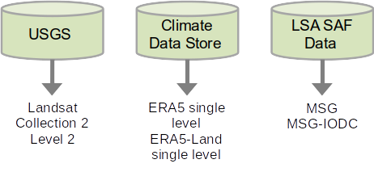
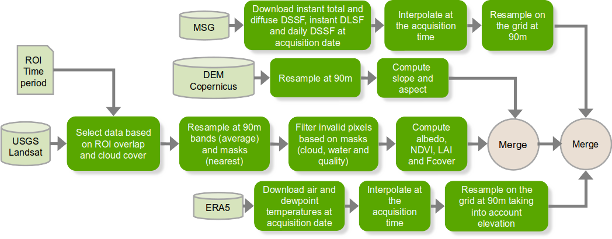

## Objective

Create data to simulate inputs for L2B ET algorithms

# L2B data

## Input list

Coming from L2A level

| Band | Tag name |
|------|----------|
| Blue reflectance | `blue` |
| Green reflectance | `green` |
| Red reflectance | `red` |
| NIR reflectance | `nir` |
| SWIR reflectance | `swir` |
| Land surface temperature | `lst` |
| Land surface emissivity | `emis` |

## Input list

Coming from L2B level

| Band | Tag name |
|------|----------|
| Downward shortwave radiation | `rsd` |
| Downward longwave radiation | `rld` |
| LAI | `lai` |
| Fcover | `fcover` |
| Albedo | `albedo` |

## Input list

Auxiliary data

| Band | Tag name |
|------|----------|
| DEM elevation | `height` |
| DEM slope | `slope` |
| DEM aspect | `aspect` |
| Temperature | `ta` |
| Dewpoint temperature | `tdp` |


# L2B Data Download

## Overview

Strategy adopted $\Rightarrow$ Full product download:

* to ensure all metadata is preserved
* to modify the preparation without having to download it again

## Input source: Where the data is downloaded?

* [USGS EarthExplorer](https://earthexplorer.usgs.gov/)
* [Climate Data Store](https://cds.climate.copernicus.eu/)
* [LSA SAF Data](https://datalsasaf.lsasvcs.ipma.pt/)

{width="80%"}

# L2B Data processing

## Prepare Landsat

### Download 

* Download from EarthExplorer-USGS Landsat Collection 2
* Download from ERA5-Land for the acquisition date

  * Air temperature
  * Dewpoint temperature

* Download from ERA5 for the acquisition date

  * Surface solar radiation downward
  * Surface thermal radiation downward

* Download MSG/MSG-IODC for the acquisition date (thus restricted to Europe, Africa, and part of Asia)
 
  * Surface solar radiation downward
  * Surface thermal radiation downward
  * Daily surface solar radiation downward

## Prepare Landsat (1/2)

### Create dataset

1. **LST**: Landsat-8 Collection 2 band 10 from EarthExplorer-USGS. Aggregation on a 90m grid.
2. **Emissivity**: No broadband emissivity in Landsat-8, just band 10 emissivity. Aggregation on a 90m grid.
3. **Albedo**: Linear combination of reflectances Landsat-8 Collection 2 bands. Aggregation on a 90m grid.
4. **NDVI**: Compute using reflectances Landsat-8 Collection 2 bands. Aggregation on a 90m grid.
5. **LAI/FCOVER**: Compute using reflectances Landsat-8 Collection 2 bands with BVnet algorithm. Aggregation on a 90m grid.

## Prepare Landsat (2/2)

### Add auxiliary data

6. **DEM**: Copernicus DEM. Aggregation on a 90m grid.
7. **Shortwave and Longwave radiation**: MSG resampled on Landsat grid (90m) with Nearest-Neighbor resampling. Time correction of the scan time of MSG depending on the latitude.
8. **Air Temperature**: Use ERA5land reanalysis (spatial and temporal interpolation at 90m)
9. **Dewpoint Temperature**: Use ERA5land reanalysis (spatial and temporal interpolation at 90m)

## Prepare landsat schema



# ET-dataset

## ET-dataset overview

Python package to prepare datasets for evapotranspiration processing:

* **Search** on catalogs that satisfy criteria
* **Download products** from a product list
* **Download auxiliary data** from a product list
* **Select** products between 2 collections that satisfy criteria
* **Create ET dataset** from products
* **Add auxiliary data** to a dataset

## Pre-requisites: download configuration

### USGS 

* Create an account
* Configure [M2M machine](https://m2m.cr.usgs.gov/)
* Set environment variables `USGS_USERNAME` and `USGS_PASSWORD` (the api key is used as a password here)

### Climate Data Store

* Create an account
* Generate a token and store the token, [see instructions](https://cds.climate.copernicus.eu/how-to-api)

### LSA SAF Data

* Create an account
* Set environment variables `LSASAF_USER` and `LSASAF_PASSWORD`

## Pre-requisites: DEM data management

* No function to download the Copernicus DEM.
* **Assumption**: to have a directory containing DEM tiles covering the entire ROI

  * DEM data expected to be stored in MGRS tiles
  * Use MNT_PATH to indicate parent directory containing DEM_Copernicus_30m

```bash
MNT_PATH/
`-- DEM_Copercinus_30m/
    `-- COP-DEM_GLO-30-DGED_[MGRS_ID_TILE].tif
```

## Pre-requisites: For installation

* **git**
* **pixi**, see instruction for installation [here](https://pixi.prefix.dev/latest/installation/).

## Installation

### Clone the repository

```bash
git clone https://github.com/CNES/et-dataset.git
```

### Install (with notebook dependencies)

```bash
cd et-dataset
pixi install
```

## Update

```bash
cd et-dataset
git pull
pixi shell
pip install .[notebook]
```

## Usage

To activate the environment
```bash
pixi shell
```

## Usage: Download landsat script

### Command line: scripts/download_landsat.py

\footnotesize
```bash
usage: download_landsat.py [-h] [-v] -r ROI -s START_DATE -e END_DATE [-o OUTPUT]
 [--max_cloud_cover MAX_CLOUD_COVER] [--min_roi_overlap MIN_ROI_OVERLAP]
Prepare Landsat data
options:
  -v, --verbose         Verbose mode
  -r ROI, --roi ROI     Path of the region of interest in Shapefile format
  -s START_DATE, --start-date START_DATE   Start date (YYYY-MM-DD)
  -e END_DATE, --end-date END_DATE         End date (YYYY-MM-DD)
  -o OUTPUT, --output OUTPUT
                        Output dataset directory path (default: current directory)
  --max_cloud_cover MAX_CLOUD_COVER        Maximum cloud cover (default: 25)
  --min_roi_overlap MIN_ROI_OVERLAP
                        Minimum overlap between ROI and a product (default: 33)
```
\normalsize

## Usage: Prepare landsat script

### Command line: scripts/prepare_landsat.py

\footnotesize
```bash
usage: prepare_landsat.py [-h] [-v] -r ROI [-o OUTPUT]
 [--mnt_path MNT_PATH]
Prepare Landsat data
options:
  -v, --verbose         Verbose mode
  -r ROI, --roi ROI     Path of the region of interest in Shapefile format
  -o OUTPUT, --output OUTPUT
                        Output dataset directory path (default: current directory)
  --mnt_path MNT_PATH   Directory of DEM tiles
```
\normalsize

## Usage: Prepare landsat notebook

### Notebooks

* `notebooks/prepare_landsat.ipynb`

## Usage: Prepare landsat script

### Output directory

\footnotesize
```bash
|-- ERA5_data   # Downloaded ERA5 data 
|   |-- download_era5_YYYY-MM-DD.zip
|   `-- download_era5land_YYYY-MM-DD.zip
|-- et_data     # Prepared data
|   `-- Landsat_YYYYMMDDTHHMMSS.tif
|-- LANDSAT     # Downloaded Landsat data
|-- LANDSAT
|   |-- LC08_L2SP_XXXXXX_XXXXXXXX_XXXXXXXX_02_T1
|   `-- LC08_L2SP_XXXXXX_XXXXXXXX_XXXXXXXX_02_T1.tar
`-- MSG_data    # Download MSG data
    `-- MSG_YYYY-MM-DD
        |-- NETCDF4_LSASAF_MSG_DIDSSF_MSG-Disk_YYYYMMDD0000.nc
        |-- NETCDF4_LSASAF_MSG_DSLF_MSG-Disk_YYYYMMDDHHMM.nc
        `-- NETCDF4_LSASAF_MSG_MDSSFTD_MSG-Disk_YYYYMMDDHHMM.nc
```
\normalsize

## Usage: Prepare landsat script

### Output file

GeoTIFF file named `Landsat_YYYYMMDDTHHMMSS.tif` containing all bands

* Reflectances: `blue`, `green`, `red`, `nir`, `swir`, `swir2`
* Vegetation variables: `ndvi`, `lai`, `fcover`
* Physical variables: `albedo`, `emis`, `lst`
* Masks: `water`, `qa`, `cloud`
* DEM variables: `height`, `slope`, `aspect`
* Radiation variables: `daily_msg`, `rsd_msg`, `fdiff_msg`, `rld_msg`, `rsd_era5`, `rld_era5`
* Meteorological variables: `ta`, `tdp`

