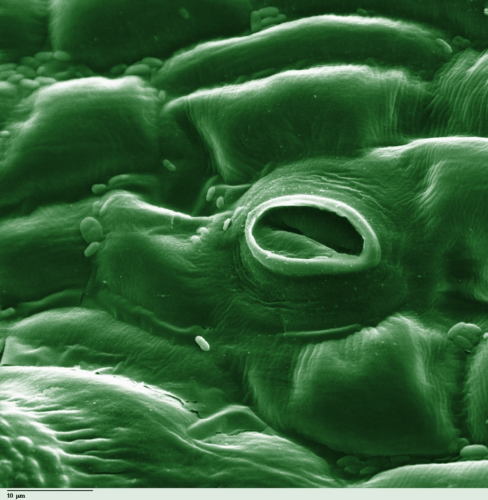
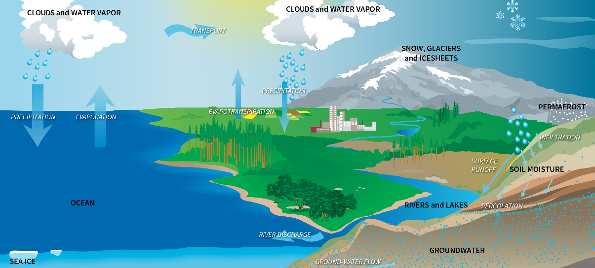
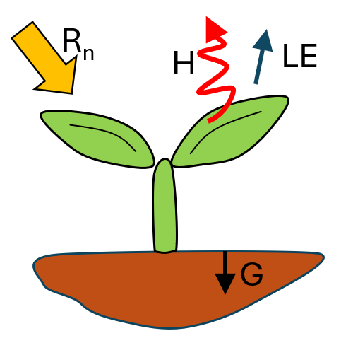
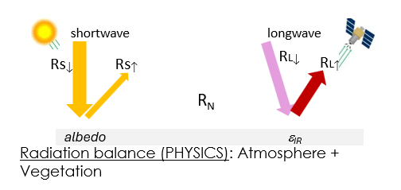
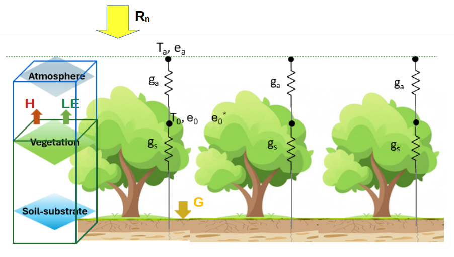
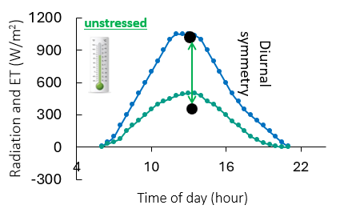
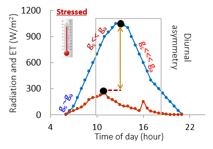

# What is evapotranspiration?

## What is evapotranspiration?

### Definition

Defined as: "The combined processes through which water is transferred to the atmosphere from open water and ice surfaces, bare soil and vegetation that make up the Earth's surface." [@glossary2023]

### Unit

Typically measured in millimeters of water in a set unit of time, i.e. volume of water moved per unit area per unit of time.

- Millimeters per day: $\text{mm.day}^{-1}$
- Millimeters per month: $\text{mm.month}^{-1}$
- Millimeters per year: $\text{mm.year}^{-1}$

## Key components of evapotranspiration

::: {.columns}

::: {.column width="60%"}

- **Evaporation (E)**: The physical process by which a liquid (e.g., water) becomes a gas (e.g., water vapour). [@glossary2023]

- **Transpiration (T)**: The process by which water vapor is released by plants through small openings called **stomata**.

$ET = E + T$

:::

::: {.column width="40%"}

:::

:::

## Focus on evaporation

### Definition

Direct water movement into the air from

- Soil
- Water bodies
- Wet vegetation surfaces
- Intercepted rainfall

### Driven factors

- temperature, 
- humidity, 
- solar radiation, 
- wind.

## Focus on transpiration

::: {.columns}

::: {.column width="60%"}

Water movement traveling from root systems through plants and exiting as vapor through tiny, microscopic pores on the outer surface, called **stomata**.

### Three main steps 

1. Roots uptake water from the soil 
2. Water moves through plant
3. Leaves release water vapor into the air through their stomata 

:::

::: {.column width="40%"}

:::

:::

## Why do plants transpire?

* Cooling effect
* Nutrient transport 
* Maintenance of internal cell pressure
* Opening of stomata, necessary for gas exchange during photosynthesis

## How much water do plants transpire?

$$\text{Transpiration ratio} = \frac{\text{Mass of water transpired}}{\text{Mass of dry matter produced}}$$

$\Rightarrow$ the transpiration ratio of crops tends to fall between 200 and 1000 

## What does transpiration affect?

- Type of plant
- Soil type
- Solar radiation
- Precipitation and soil moisture
- Humidity
- Temperature
- Wind
- Land slope 

## What is the role of evapotranspiration?

### Major component of the hydrological cycle and climate

- Transfer water from the land surface to the atmosphere $\rightarrow$ Two-thirds of the precipitation
- Influence local and regional climate

### Key role in water resource management and agricultural irrigation 

- Determine crop water requirements
- Support drought monitoring and water-resource management

## The water cycle and evapotranspiration

## What are the primary drivers of evapotranspiration?

**Water Availability** The volume of water present in the soil and larger surface water bodies $\rightarrow$ *fuel*

**Available energy** The amount of energy available in the air and soil $\rightarrow$ *engine*

**Atmospheric Demand** The humidity levels and the atmosphere's capacity to absorb water $\rightarrow$ *pump*

## What are the impact of each meterological factors?

* **Solar radiation** Increase available energy 
* **Air temperature** Higher temperatures generally increase atmospheric demand for water vapor.
* **Relative humidity** and **vapor-pressure deficit** High VPD usually increases ET if water is available.
* **Wind speed** Wind removes moist air near the surface and replaces it with drier air, increasing ET.
* **Precipitation** Rainfall supplies water for evaporation and replenishes soil moisture.

## What are the impact of each surface/vegetation factors?

* **Soil moisture** Controls whether evaporation and transpiration can continue. When soil moisture becomes limited, actual ET decreases.
* **Leaf area index** Higher LAI generally increases transpiration until the canopy becomes sufficiently dense.
* **Canopy resistance** High canopy resistance reduces transpiration.
* **Surface roughness** Tall or dense vegetation increases turbulence and can enhance exchange with the atmosphere.
* **Albedo** Bright surfaces reflect more solar radiation and generally absorb less energy.

## What are the Environmental and Human Factors?

- Topography and elevation
- Slope and aspect
- Soil texture
- Land-cover type
- Irrigation
- Drainage
- Salinity
- Urbanization
- Deforestation
- Fire and land degradation
- Seasonal vegetation development

## Why are there different types of evapotranspiration?

- Reference evapotranspiration: $ET_0$
- Potential evapotranspiration: $ET_p$
- Crop evapotranspiration: $ET_c$
- Actual evapotranspiration: $ET_a$

## Reference evapotranspiration: $ET_0$

* Represent the atmospheric evaporative demand for a standardized, well-watered reference surface.

- Uses a hypothetical grass reference surface
  - A short actively growing grass, about 0.12 m tall, completely shading the ground, well supplied with water, with standardized surface resistance and albedo

* Depends mainly on weather conditions: air temperature, solar radiation, wind speed, humidity, atmospheric pressure
* Provides a ET baseline based on atmospheric demands (meteorological conditions)

## Potential evapotranspiration: $ET_p$

* Represents evapotranspiration that could occur if water were freely available.

* Assumes that:

  - Soil water content is not limiting
  - The surface can evaporate and transpire at its maximum rate
  - Atmospheric conditions determine the evaporative demand

- Refers to maximum possible ET

## Crop evapotranspiration: $ET_c$

* Represents evapotranspiration of a particular crop under adequate water supply and non-stressed conditions.

$$
ET_c = K_c ET_0
$$

where:

- $ET_c$ = crop evapotranspiration
- $K_c$ = crop coefficient $\rightarrow$ **Crop characteristics**
- $ET_0$ = reference evapotranspiration $\rightarrow$ **Atmospheric demand**

## Crop evapotranspiration: crop coefficient 

* Depends on: crop type, crop height, growth stage, canopy development, surface roughness

* Varies during crop development

  1. **Initial stage**  Small plants and substantial exposed soil  
   $\rightarrow$ low $K_c$
  2. **Development stage**  Increasing canopy and transpiration  
   $\rightarrow$ increasing $K_c$
  3. **Mid-season stage** Full canopy and maximum water use  
   $\rightarrow$ high $K_c$
  4. **Late-season stage** Senescence and reduced transpiration  
   $\rightarrow$ decreasing $K_c$

## Actual evapotranspiration: $ET_a$

* Represents the amount of water that actually leaves a real soil–plant system.

* Depends on:

  - Weather conditions
  - Soil-water availability
  - Crop type and growth stage
  - Canopy characteristics
  - Irrigation and management
  - Plant water stress

$ET_a < ET_p$

## Relationships between ET terms

$$
ET_0
\longrightarrow
ET_c
\longrightarrow
ET_a
$$

## How to take into account for water stress?

If water is limited, actual ET is lower than unstressed crop ET.

### Single-coefficient approach

$$
ET_a = K_s ET_c = K_s K_c ET_0
$$

where:

- $K_s$ = water-stress coefficient $0 \leq K_s \leq 1$

  - $K_s = 1$: no water stress
  - $K_s < 1$: water stress reduces ET
  - $K_s = 0$: ET is effectively stopped in the model

## How to take into account for water stress?

If water is limited, actual ET is lower than unstressed crop ET.

### Dual-coefficient approach

$$
ET_a = (K_{cb}K_s + K_e)ET_0
$$

where:

- $K_{cb}$ = basal crop transpiration coefficient
- $K_s$ = water-stress coefficient
- $K_e$ = soil-evaporation coefficient

The dual approach separates:

- Transpiration by the crop
- Evaporation from the soil surface

## Summary table

| Concept | Main question answered |
|---|---|
| $ET_0$ | How strong is the atmospheric evaporative demand? |
| $ET_p$ | How much ET could occur if water were unlimited? |
| $ET_c$ | How much would this crop use if it were not stressed? |
| $ET_a$ | How much water is actually being lost? |

## Key equations

$$
ET = E + T
$$

$$
ET_c = K_c ET_0
$$

$$
ET_a = K_s K_c ET_0
$$

or, with separate soil evaporation:

$$
ET_a = (K_{cb}K_s + K_e)ET_0
$$

# How to model evapotranspiration?

## Two approaches

* **Water Balance Equation** 
* **Surface Energy Balance Equation** 

## Water Balance Equation

$$
P = ET + R + D + \Delta S
$$ 

Where:

- $P$ = precipitation
- $ET$ = evapotranspiration
- $R$ = runoff
- $D$ = deep drainage or groundwater recharge
- $\Delta S$ = change in water storage

## Surface energy equation equation

::: {.columns}

::: {.column width="60%"}

$$R_n = G + LE + H$$ 

Where 

- $R_n$ = net radiation
- $G$ = soil heat flux
- $H$ is sensible heat flux 
- $LE$ = latent heat flux
  
:::

::: {.column width="40%"}

:::

:::

$$ LE = \lambda ET$$

where $\lambda$ is the specific latent heat for vaporization

## Net radiation

$$
R_n = R_{SD}(1-\alpha)+\epsilon(R_{LD} - \sigma_{SB}T_{s}^{4})
$$

Where 

- $R_{SD}$ shortwave downwelling radiation
- $R_{LD}$ longwave downwelling radiation
- $\epsilon$ land surface emissivity
- $\alpha$ land surface albedo
- $T_s$ land surface temperature
- $\sigma_{SB}$ Stefan-Boltzmann constant

## How to represent the soil-vegetation system?

Different representations

![Different configurations of resistance networks[@zhang2016]](images/seb_models.png){height="80%"}

## Focus with one source model

## What temperature are we talking about? 

-   **Aerodynamic temperature**: Aerodynamic temperature is the air
    temperature at the thermal roughness length. It is a key parameter
    in models simulating land-atmosphere processes, which are relevant
    in numerous applications.

-   **Thermodynamic temperature**: Thermodynamic temperature is a
    macroscopic quantity thought to be constant throughout any group of
    subsystems that are in thermodynamic equilibrium, assuming therefore
    no heat transfer.

-   **Directional brightness temperature**: It is the temperature of a
    black body that would have the same radiance as the radiance
    actually observed with the radiometer.

-   **Directional radiometric temperature**: A directional radiometric
    temperature is derived from a radiative energy balance of a surface
    and provides the best approximation to the thermodynamic temperature
    based on a measure of radiance. It is the quantity to estimate from
    satellite observations in the domain of LST inversions.

-   **Surface component temperature**: This is the temperature of the
    various elements that contribute to the pixel's radiance.*

See [@norman_terminology_1995] for more details.

## Analogy with Ohm's law

$$
\text{Flux} = \dfrac{\text{Difference in potential}}{\text{Resistance}} = \text{Conductance} \times (\text{Difference in potential})
$$

* **Electricity** $I = \Delta V / R$ (Ohm's law) The flux of electric current is directly related to the difference in electric potential.
* **Thermodynamics** $\Phi = -k \nabla T$ (Fourier's law) Heat flux flows from regions of high thermal potential (high temperature) to regions of low potential (low temperature)
* **Fluid mechanics** Fluid flux flows from areas of high pressure (high pressure potential) to areas of low pressure.

## Air conductance

* Represents how easily water vapor can move through the air layer surrounding the leaf 
* Depends on:

  - Wind speed $\rightarrow$ stronger wind removes the moist air layer around the leaf, allowing more evaporation
  - Roughness $\rightarrow$ Leaf shape and size change the roughness and affect how turbulent the air becomes

* Is largely passive and not controlled by the plant 

## Stomatal conductance

* Represents how open the stomata are to allow water vapor to escape

  - When stomata are wide open, conductance is high $\Rightarrow$ water vapor escapes easily from inside the leaf
  - When stomata are closed or partially closed, conductance is low $\Rightarrow$ less water vapor can escape

* Plants control the stomata opening:

  - they open stomata to take in $CO_2$ for photosynthesis, but this comes at the cost of water loss. 
  - they close stomata to conserve water, especially during dry conditions.

## Air conductance and stomatal conductance in evapotranspiration

* If stomatal conductance is very low but air conductance is high, water loss is still limited by the stomata. 
* If stomatal conductance is high but air conductance is low (still air), water loss is limited by how slowly vapor can diffuse away.

## Sensible flux

For one source representation

$$H = \rho c_p g_a (T_0 - T_a)$$

where 

* $\rho$ is the density of air at constant pressure ($kg.m^{-3}$), 
* $c_p$ is the specific heat of air at constant pressure ($J.kg^{-1}.K^{-1}$) $\rightarrow$ *It corresponds to the amount of heat that must be added to one unit of mass of air in order to cause an increase of one unit in temperature.* 
* $T_0$ is the aerodynamic temperature
* $T_a$ is the air temperature
* $g_a$ air conductance ($m.s^{-1}$)

## Latent heat flux

$$LE = \frac{\rho c_p}{\gamma}\frac{g_a g_s}{g_a + g_s} (e_{0}^{\star} - e_a)$$

where

* $\rho$ is the density of air at constant pressure ($kg.m^{-3}$), 
* $c_p$ is the specific heat of air at constant pressure ($J.kg^{-1}.K^{-1}$)
* $\gamma$ is the psychrometric constant ($hPa.K^{-1}$) $\rightarrow$ It relates the partial pressure of water in air to the air temperature.
* $e_{0}^{\star}$ is the saturation vapor pressure at T0 ($hPa$)
* $e_a$ is the vapor pressure at Ta ($hPa$)
* $g_a$ air conductance ($m.s^{-1}$)
* $g_s$ stomatal conductance ($m.s^{-1}$)

## Ecosystem functioning with unstressed stomata
 

* Radiation explains **75 - 80%** of ET variability
* Stomatal control: **not significant**

## Stressed vegetation

* **strong hysteresis**: Surface temperature vs radiation
* **high thermal inertia**

# A very large numbers of evapotranspiration methods

## Overview of evapotranspiration estimation approaches

1. **Empirical or meteorological models**
2. **Physically based surface-energy-balance models**
3. **Models using optical remote-sensing data**
4. **Models using optical and thermal infrared remote-sensing data**

Each method involves a trade-off between

- Data requirements
- Physical realism
- Spatial coverage
- Temporal frequency
- Computational complexity
- Accuracy and uncertainty

## Empirical and Meteorological Models

### Typical inputs

- Temperature, Precipitation, Solar radiation, Relative humidity, Wind speed, Day length

### Advantages

- Easy to implement
- Low computational cost
- Useful where data are limited
- Suitable for regional or long-term studies

### Limitations

- Often calibrated for specific climates
- May not transfer well to other regions
- Can perform poorly under unusual conditions
- May not represent vegetation stress explicitly

## Physically based surface-energy-balance models: Penman-Monteith

$$
LE = \frac{\Delta(R_n-G)+\rho C_p VPD/r_a}{\Delta + \gamma(1+r_s/r_a)}
$$ 
$$
\Delta = \frac{\text{d}e_{sat}}{\text{d}T}
$$ 
$$
VPD = e_{sat}-e_a
$$

- $e_{sat}$ saturated vapor pressure
- $e_a$ vapor pressure at air temperature
- VPD Vapor Pressure Deficit
- $\gamma$ psychrometric constant
- $r_a$ aerodynamic resistance modeled based on crop height, $u$ wind, roughness parameters
- $r_{s}$ surface resistance modeled based on LAI, leaf resistance

## Physically based surface-energy-balance models: FAO56

Use to compute reference 

$$
ET_0 = \frac{0.408 \Delta (R_n - G) + \gamma\frac{900}{T_a}uVPD}{\Delta+\gamma(1+0.34u)}
$$

- $T_a$ air temperature
- $u$ wind
- $\Delta$ slope of the saturation vapor pressure and temperature curve
- $VPD$ vapor pressure deficit
- $R_n$ net radiation
- $G$ ground flux

See FAO56 [@allen_fao_1998]

## Physically based surface-energy-balance models: FAO56

### Advantages

- Physically based
- Widely accepted for reference ET
- Performs well when complete weather data are available

### Limitations

- Requires many meteorological inputs
- Sensitive to the quality of radiation, wind, humidity, and temperature data
- Reference-surface assumptions may not describe heterogeneous landscapes

## Physically based surface-energy-balance models: Priestley-Taylor

$$
LE = \frac{\alpha_{PT}\Delta(R_n-G)}{\Delta+\gamma}
$$

- $\alpha_{PT}$ Priestley-Taylor parameter
- Do not take into account the water stress

## Models using optical remote-sensing data

Some models combine optical data with radiation and meteorological observations.

Optical remote sensing provides information about:

- Albedo
- Fraction of vegetation cover
- LAI
- Canopy structure
- Surface roughness
- Photosynthetic activity

Optical remote sensing does not directly measure ET. Instead, it estimates variables related to transpiration and vegetation condition.

## Models using optical remote-sensing data

### Advantages

- Relatively simple
- Useful for agricultural monitoring
- Provides spatial information
- Can be applied over large areas

### Limitations

- NDVI can saturate in dense vegetation
- Optical observations are affected by clouds
- Vegetation indices do not directly measure water stress
- Calibration is often crop- and region-dependent

## Models using optical and thermal infrared remote-sensing data

### Interest of surface temperature

**Land Surface Temperature** is useful because ET cools the land surface:

- High ET usually produces lower surface temperature
- Low ET or water stress often produces higher surface temperature

TIR remote sensing is therefore particularly useful for detecting water stress.

## Models using optical and thermal infrared remote-sensing data

Surface temperature is a key indicator of plant water stress and soil moisture conditions.

::: {.columns}

::: {.column width="50%"}

### What Does a Hot Surface Indicate?

A hot surface may indicate:

- Low soil moisture
- Reduced transpiration
- Closed stomata
- Sparse vegetation
- High sensible heat flux
- Strong atmospheric demand

:::

::: {.column width="50%"}

### What Does a Cool Surface Indicate?

A cool surface may indicate:

- Active transpiration
- Wet soil
- Dense vegetation
- Irrigation
- High latent heat flux

:::

:::

## Models using optical and thermal infrared remote-sensing data

### Factors Influencing Surface Temperature

However, surface temperature can also be influenced by:

- Wind
- Surface roughness
- Air temperature
- Radiation
- Soil texture
- Vegetation structure

### Interpreting Surface Temperature

Therefore, temperature should be interpreted together with meteorological and vegetation data.

## Single-Source Energy-Balance Models: overview

$$
LE = R_n - G - H
$$ 
$$
H = \rho C_p \frac{T_{aero}-T_a}{r_a}
$$

- $\rho$ air density
- $C_p$ specific heat
- $T_{aero}$ aerodynamic surface temperature $T_{aero} \approx T_s$
- $r_a$ aerodynamic resistance modeled based on crop height, $u$ wind, roughness parameters

## Single-Source Energy-Balance Models: General procedure

1. Estimate surface temperature
2. Calculate net radiation
3. Estimate soil heat flux
4. Estimate sensible heat flux
5. Derive latent heat flux
6. Convert latent heat flux to ET

## Single-Source Energy-Balance Models

### Strengths

- Provides spatially distributed ET
- Detects field-scale water stress
- Useful for irrigation management
- Can cover large regions

### Limitations

- Requires careful calibration
- Sensitive to atmospheric data

## Single-Source Energy-Balance Models: Examples

* SEBAL **Surface Energy Balance Algorithm for Land**
* METRIC **Mapping Evapotranspiration at High Resolution with Internalized Calibration**
* SEBS **Surface Energy Balance System**

## Two-Source Energy-Balance Models

Two-source models separate the land surface into: vegetation (or canopy) and soil

$$
LE = R_n - G - H = R_n - G - H_{canopy} - H_{soil}
$$ 
$$
H_{canopy} = \rho C_p \frac{T_{canopy}-T_a}{r_{canopy}}
$$ 
$$
H_{soil} = \rho C_p \frac{T_{soil}-T_a}{r_{soil}}
$$ 
$$
T_s = \left(f_c T_{canopy}^4 + (1-f_c)T_{soil}^4\right)^{1/4}
$$

- $f_c$ vegetation fraction cover
- $T_{canopy}$ canopy temperature
- $T_{soil}$ soil temperature
- $r_{soil}$ surface resistance
- $r_{canopy}$ canopy resistance modeled based on LAI, leaf resistance

## Two-Source Energy-Balance Models

### Advantages

- Separates evaporation and transpiration
- Better represents sparse vegetation
- Useful for heterogeneous surfaces
- Can improve water-stress estimation

### Limitations

- Requires more parameters
- More computationally complex
- Needs information about canopy and soil temperatures or their partitioning

## Two-Source Energy-Balance Models: Examples

- ALEXI **Atmosphere–Land Exchange Inverse**
- DisALEXI **Disaggregation Atmosphere–Land Exchange Inverse**
- SPARSE **Soil Plant Atmosphere and Remote Sensing Evapotranspiration**

## Comparison of ET Estimation Methods

::: {.text-tiny}

| Method | Main data | Main output | Strengths | Limitations |
|---|---|---|---|---|
| Empirical models | Temperature, radiation, precipitation, or limited weather data | Potential or reference ET | Simple and inexpensive | Site-specific and less physically detailed |
| Penman–Monteith | Radiation, temperature, humidity, and wind | Reference ET | Physically based and widely accepted | Requires complete weather data |
| Optical remote sensing | Reflectance, vegetation indices, LAI, albedo | Spatial crop coefficients or vegetation parameters | Large-area vegetation monitoring | Weak direct sensitivity to water stress |
| TIR remote sensing | Land-surface temperature, radiation, weather data | Actual ET and surface fluxes | Detects water stress and spatial ET patterns | Cloud-sensitive and data-intensive |
| Hybrid models | Weather, optical, TIR, and land-surface data | High-resolution actual ET | Combines complementary information | More complex and requires integration |

:::

# TRISHNA evapotranspiration models

## Model selected for TRISHNA

* [STIC](stic.qmd) **Surface Temperature Initiated Closure**
* [EVASPA](evaspa.qmd) **Evapotranspiration from SPAce**

## Why this choice ?

* Delivering actual evapotranspiration (ET) at less than 100m resolution is challenging, mainly because the performance is driven by meteorological inputs that are only available at a very low spatial resolution (0.1°) through ECMWF analysis.

* STIC require few meteorological data, only air temperature and dewpoint temperature and daily radiation
* EVASPA require only daily radiation

# How to extrapolate to daily

## Extrapolation to daily evapotranspiration

- Done through an extrapolation of instantaneous data to the daily scale thanks to the use of the solar radiation ratio.
- Defined as

$$
ET^{daily} = \frac{R_{SD}^{daily}}{R_{SD}^{inst}}ET^{inst}
$$

- $ET^{inst}$ evapotranspiration at the time of TRISHNA acquisition
- $ET^{daily}$ ($mm.d^{-1}$) daily evapotranspiration
- $R_{SD}^{inst}$ downwelling shortwave radiation at the time of TRISHNA acquisition
- $R_{SD}^{daily}$ daily value of downwelling shortwave radiation

## References

