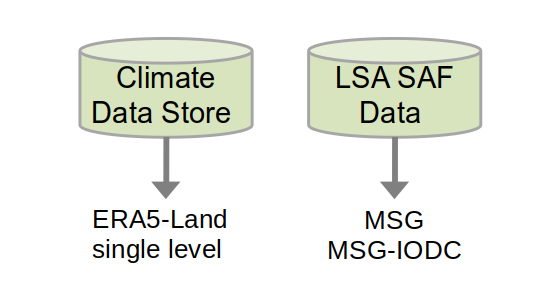
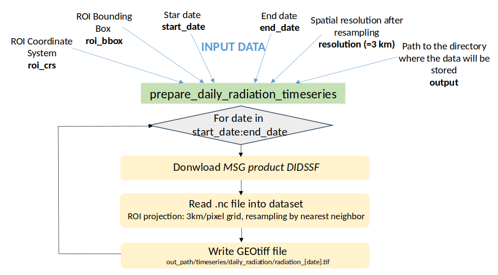
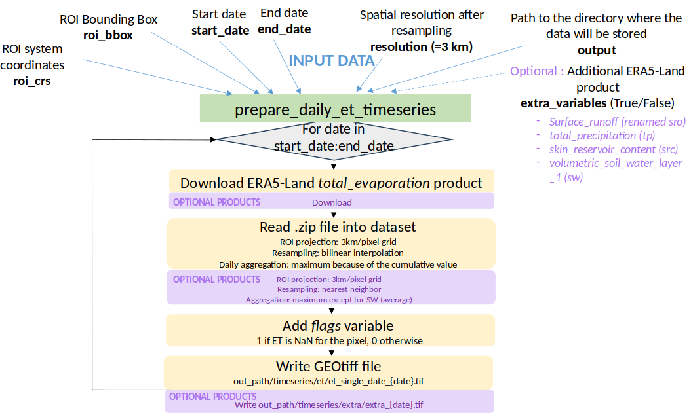
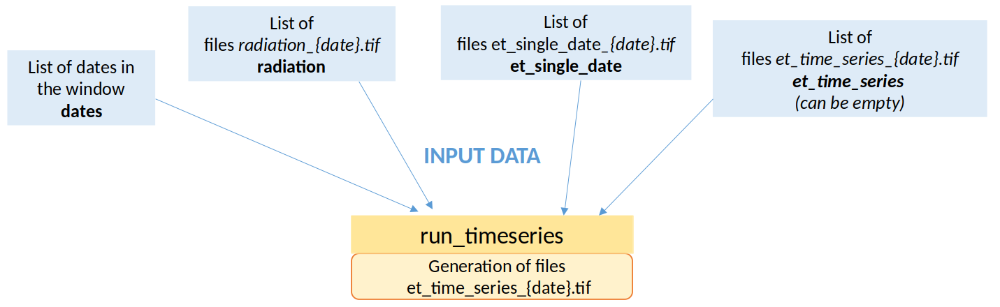
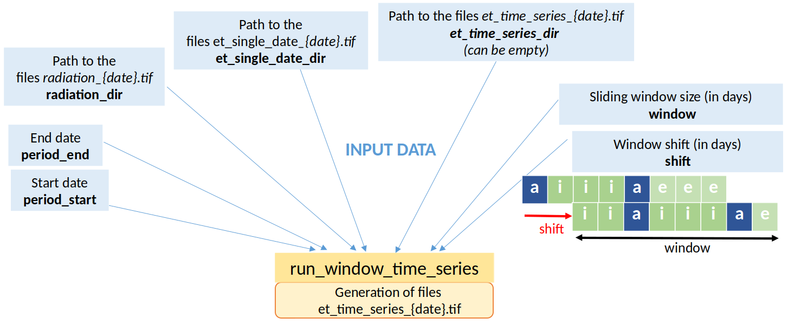

# ET Timeseries

## Overview

* Algorithm for calculating an evapotranspiration time series from L2B level products and auxiliary data

## Algorithm

### Evolution of a pixel's ET time series


## Algorithm

### Update strategy

* interpolation between two existing acquisition values
* extrapolation beyond the last previous available acquisition value
* backward extrapolation from the next available acquisition value

## Algorithm

### Update timeseries


## Algorithm

* V0: Implementation of interpolation/extrapolation based only a solar daily radiation 

## Algorithm step


# L3 data preparation

## Input list

* Daily ET timeseries (used to simulation acquisition and also as reference)
* Daily radiation timeseries
* Other meteorological variables timeseries

## Input source: Where the data is downloaded?

* [Climate Data Store](https://cds.climate.copernicus.eu/)
* [LSA SAF Data](https://datalsasaf.lsasvcs.ipma.pt/)

## Input source: What data is downloaded?

{.nostretch width="80%" fig-align="center"}

## Configuration

### Climate Data Store

* Create an account
* Generate a token and store the token, [see instructions](https://cds.climate.copernicus.eu/how-to-api)

### LSA SAF Data

* Create an account
* Set environment variables `LSASAF_USER` and `LSASAF_PASSWORD`

## Prepare daily radiation timeseries



## Prepare daily ET timeseries



## Usage: Prepare timeseries script

### Command line: scripts/prepare_timeseries.py

\footnotesize
```bash
usage: prepare_timeseries.py [-h] -s START_DATE -e END_DATE -r ROI [-o OUTPUT]

options:
  -h, --help            show this help message and exit
  -s START_DATE, --start_date START_DATE
                        start date (YY-MM-DD)
  -e END_DATE, --end_date END_DATE
                        end date (YY-MM-DD)
  -r ROI, --roi ROI     Path of the region of interest in Shapefile format
  -o OUTPUT, --output OUTPUT
                        Output directory
```
\normalsize

## Usage: Prepare timeseries script

### Notebooks

* [`notebooks/prepare_timeseries.ipynb`](https://github.com/CNES/et-dataset/blob/main/notebooks/prepare_timeseries.ipynb)

## Usage: Prepare timeseries script

### Output directory

```bash
|-- ERA5_data
    `-- download_era5land_YYYY-MM-DD.zip
|-- MSG_data
|   |-- MSG_YYYY-MM-DD
|   |   `-- NETCDF4_LSASAF_MSG_DIDSSF_MSG-Disk_YYYYMMDD0000.nc
`-- timeseries
    |-- daily_radiation
    |   `-- radiation_YYYYMMDD.tif
    |-- et
    |   `-- et_single_date_YYYYMMDD.tif
     `-- extra
        `-- extra_YYYYMMDD.tif
```

# ET timeseries in SWEAT

## Usage: Command line

### timeseries: Update ET timeseries over a window

```bash
Usage: timeseries [OPTIONS] INPUT_FILE

Options:
  --verbose / --no-verbose  Debug logging mode
  --version                 Show the version and exit.
  -h, --help                Show this message and exit.
```

## Usage: Command line

### timeseries: Update ET timeseries over a window




## Usage: Command line

### window_timeseries: Generate ET timeseries over a time period

```bash
Usage: window-timeseries [OPTIONS] INPUT_FILE

Options:
  --verbose / --no-verbose  Debug logging mode
  --version                 Show the version and exit.
  -h, --help                Show this message and exit.
```

## Usage: Command line

### window_timeseries: Generate ET timeseries over a time period




## Usage: Notebook

### Update ET timeseries over a window

* Main notebook [**notebooks/run_timeseries.ipynb**](https://github.com/CNES/sweat/blob/main/notebooks/run_timeseries.ipynb)

### Generate ET timeseries over a time period

* Main notebook [**notebooks/run_window_timeseries.ipynb**](https://github.com/CNES/sweat/blob/main/notebooks/run_windows_timeseries.ipynb)

## Configuration

### Input configuration

* Detailed in [usage page](https://github.com/CNES/sweat/blob/main/docs/timeseries/usage.md) and [configuration page](https://github.com/CNES/sweat/blob/main/docs/timeseries/configuration.md)

## Exercises

- Test [**tutorial_et_timeseries.ipynb**](../notebooks/tutorial_et_timeseries.ipynb)
