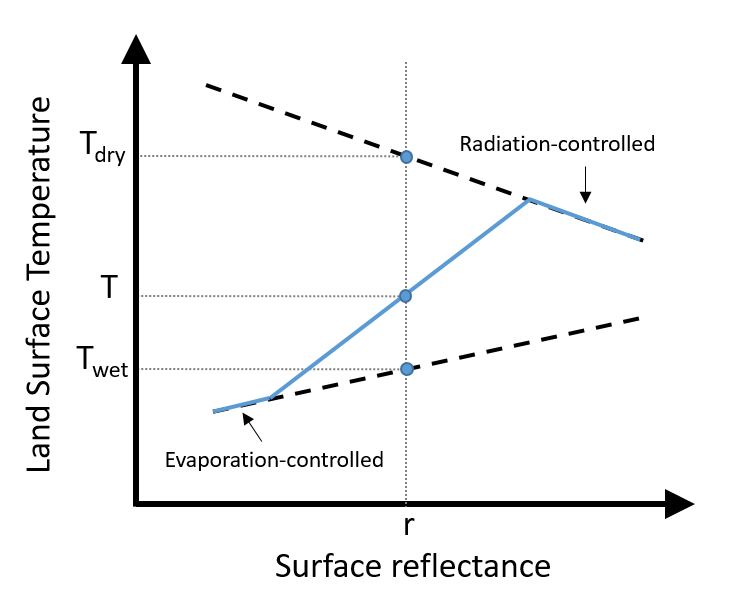
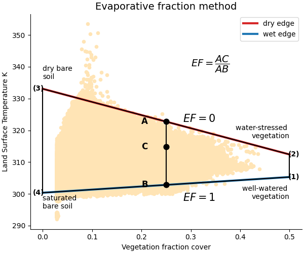

# EVASPA: EVApotranspiration from SPAce

## Overview

Ensemble approach

- Uses multiple contextual algorithms based on EF models
- Computes average and dispersion of results across algorithms
- Provides final EF estimate and reliability assessment

See [@gallego-elvira_evaspa_2013]

## Methodological principle: Model Assumptions & Limitations

- Requires only incident radiation data (no auxiliary meteorological inputs)
- Assumes land surface temperature variations result from variations in water content, vegetation, or surface albedo
- Assumes no variations in climatic variables, no variations in aerodynamic parameters, and no variations related to topography across the domain
- **Limitation:** Algorithm fails if these uniform conditions aren't met

## Methodological principle

::: columns
::: {.column width="50%"}

- Correlation between surface temperature and reflectance of areas subject to constant atmospheric forcing
- Two distinct thermal regimes exist under constant atmospheric forcing:
  - **Evaporation-controlled** (lower temperature): Temperature changes driven by soil moisture availability
  - **Radiation-controlled** (higher reflectance): Temperature decreases with increasing reflectance when soil moisture is depleted and evaporation ceases

:::

::: {.column width="50%"}

:::
:::

## Algorithm

### Evaporative fraction

- Quantity of energy which is allocated to evapotranspiration in regards to the available energy.
- Defined as

$$
EF = \frac{LE}{LE+H} = \frac{LE}{R_n-G}
$$

## Algorithm

### Evaporative fraction

:::: columns
::: {.column width="50%"}

:::

::: {.column width="50%"}
$$
EF = \frac{T_{dry}-T}{T_{dry}-T{wet}}
$$

\vspace{1cm}

- For fully wet conditions, i.e. Twet where LE = Rn-G and H= 0
- For fully dry conditions, i.e. Tdry where H = Rn - G and LE=0

:::
:::

## Algorithm

### Evapotranspiration from evaporative fraction

$$
ET = \frac{LE}{L} = \frac{EF(R_n-G)}{L}
$$

