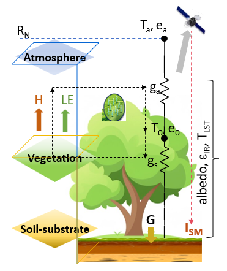
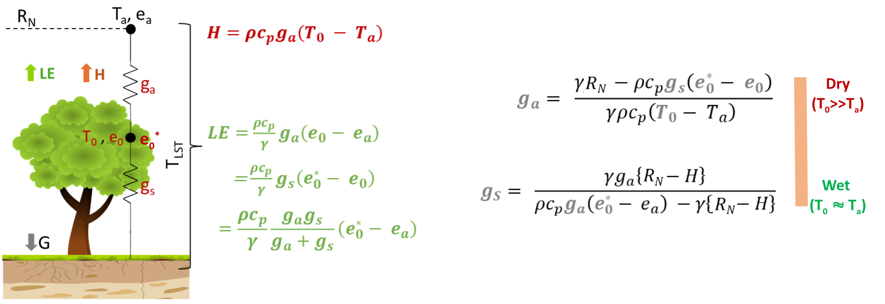
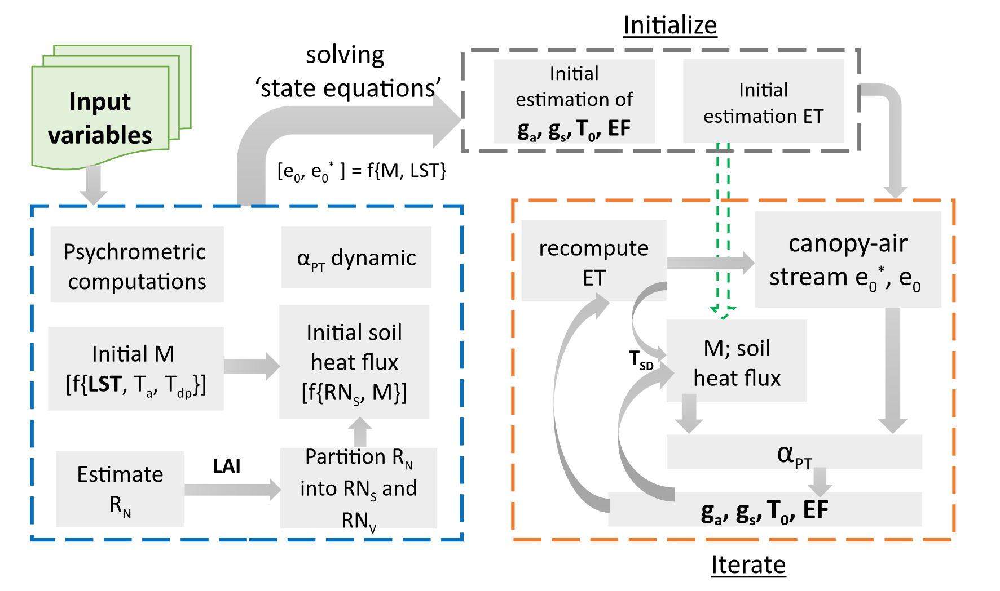

# STIC: Surface Temperature Initiated Closure

## Overview

Surface Temperature Initiated Closure (STIC) Algorithm [@mallick_surface_2014]

- Purpose: Single-pixel evapotranspiration (ET) estimation
- Model Type: One-source Surface Energy Balance (SEB) model
- Innovation: Uniquely integrates Land Surface Temperature (LST) directly into the Penman-Monteith formulation

## Inputs

The objective of minimizing the impact of exogenous meteorological information on the performance of the product, as it only depends on surface temperature and air humidity.

## Core Approach & Key Components

### Analytical Framework

::: columns
::: {.column width="35%"}

:::

::: {.column width="65%"}

- Combines LST with aerodynamic and heat balance equations
- Determines two conductances:
  - Aerodynamic conductance (ga) — efficiency of air transport of heat and moisture
  - Surface conductance (gs) — vegetation canopy's ability to exchange water vapor

:::
:::

## Core Approach & Key Components

### Analytical Framework

::: columns
::: {.column width="35%"}

:::

::: {.column width="65%"}

- Integrates:
  - LST-driven water stress index
  - Aerodynamic equations for sensible (H) and latent (LE) heat
  - Modified complementary relationship advection-aridity hypothesis
  - Shuttleworth-Wallace sparse canopy + Penman-Monteith big-leaf models

:::
:::

## Principle

## Algorithm

## Detailed algorithm

## References