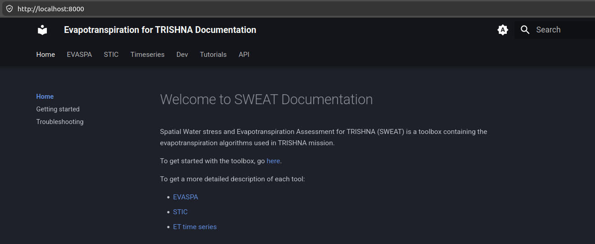
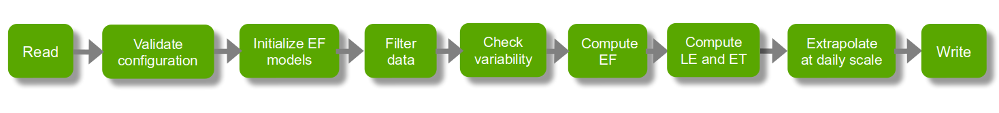

## Overview

SWEAT contains several algorithms used in TRISHNA mission to compute evapotranspiration:

- **EVASPA** EVApotranspiration from SPAce
- **STIC** Surface Temperature Initiated Closure
- **ET time series**

## Pre-requisites

- **git**
* **pixi**, see instruction for installation [here](https://pixi.prefix.dev/latest/installation/).

## Installation

### Clone the repository

```bash
git clone https://github.com/CNES/sweat.git
```

### Install

```bash
cd sweat/
pixi install
```

### Install notebooks dependencies

```bash
pixi shell
pip install .[notebook]
```

## Update

```bash
cd et-dataset
git pull
pixi shell
pip install .[notebook]
```

## Developer installation

### Install in a developer mode (dev tools, notebooks, docs)

```bash
pixi install -e dev
```

### Update in developer mode

```bash
cd et-dataset
git pull
pixi shell -e dev
```

## Usage: Command line

### Activate the environment

```bash
pixi shell [-e dev]
```

### Command line

4 main commands available

- **evaspa**
- **stic**
- **timeseries**
- **window_timeseries** (timeseries over a period)

## Usage: High-level API

Provide by module `sweat.api`

- **run_evaspa**
- **run_stic**
- **run_timeseries**
- **run_window_timeseries**

## Usage: Notebooks

Provide examples to use API

### Activate the environment

```bash
pixi shell
jupyter-lab
```

### Notebooks

- Main notebooks located in the root of notebooks directory
- More detailed notebooks in subdirectories of notebooks directory

## Documentation generation

### Installation

```bash
pixi shell
pip install -e .[docs]
```

### Build the documentation

```bash
mkdocs build
```

### Start the live-reloading docs server

```bash
mkdocs serve
```

## Documentation visualization

Open <http://localhost:8000/>



## Remark on inputs

- SWEAT uses the band descriptions during input reading to determine which variable each band corresponds to.
- It is essential to correctly write the band name in the description field and to ensure that the band names match the expected format.
- SWEAT is compatible with et-dataset.

# STIC

## STIC Algorithm steps


## Usage: Command line

```bash
Usage: stic [OPTIONS] INPUT_FILE

Options:
  --verbose / --no-verbose  Debug logging mode
  --version                 Show the version and exit.
  -h, --help                Show this message and exit.
```
## Usage: Command line

### Input file description

* **input**: provide information for input data
* **output**: provide information to write results
* **params**: provide parameters to processing steps
* **debug** (optional): provide information for debug mode

## Usage: Command line

An example of input file:

```json
{
    "input":{
        "path": "tests/data/data_test_20230303T112730.tif",
        "date": "2023-03-03T11:27:30-00:00"
    },
    "output":{
        "path":"out"
    }
}
```

## Usage: Command line

### Output description

- a directory **stic_daily** which contains daily products: LE, ET and flags
- a directory **stic_inst** which contains instantaneous products: EF, LE, ET and flags
- a directory **stic_waterstress** which contains water stress products: water stress and flags
- a file **config.json** which contains the detailed configuration used
- a directory **debug** if debug mode is activated

## Usage: High-level API

```bash
def run_stic(
    data: xr.Dataset, params: dict, debug: dict | None = None
) -> tuple[xr.Dataset, xr.Dataset, xr.Dataset] | None:
```

### Inputs

- **data** input data
- **params** parameters configuration
- **debug** debug configuration

### Outputs

- Instant dataset: EF, LE, ET and flags
- Daily dataset: LE, ET and flags
- Water stress dataset: water stress and flags

## Usage: Notebook

- Main notebook [**../notebooks/run_stic.ipynb**](https://github.com/CNES/sweat/blob/main/../notebooks/run_stic.ipynb)

## Configuration

### Input configuration

- Detailed in [usage page](https://github.com/CNES/sweat/blob/main/docs/stic/usage.md) and [configuration page](https://github.com/CNES/sweat/blob/main/docs/stic/configuration.md)

## Exercises

- Test [**tutorial_stic.ipynb**](../notebooks/tutorial_stic.ipynb)
- Test [**tutorial_stic_on_sites.ipynb**](../notebooks/tutorial_stic_on_sites.ipynb)

# EVASPA

## Algorithm Steps



## Usage: Command line

``` bash
Usage: evaspa [OPTIONS] INPUT_FILE

Options:
  --verbose / --no-verbose  Debug logging mode
  --version                 Show the version and exit.
  -h, --help                Show this message and exit.
```

## Usage: Command line

### Input file description

* **input**: provide information for input data
* **output**: provide information to write results
* **params**: provide parameters to processing steps
* **debug** (optional): provide information for debug mode

## Usage: Command line

An example of input file:

```json
{
    "input":{
        "path": "tests/data/data_test_20230303T112730.tif",
        "date": "2023-03-03T11:27:30-00:00"
    },
    "output":{
        "path":"out"
    },
    "params":{
        "ef":{
            "models": "default_evaspa"
        }
    }
}
```

## Usage: Command line

### Output description

- a directory **evaspa_daily** which contains daily products: LE, ET and flags
- a directory **evaspa_inst** which contains instantaneous products: EF, LE, ET and flags
- a directory **evaspa_waterstress** which contains water stress products: water stress and flags
- a file **config.json** which contains the detailed configuration used
- a directory **debug** if debug mode is activated

## Usage: High-level API

```bash
def run_evaspa(
    data: xr.Dataset, params: dict, debug: dict | None = None
) -> tuple[xr.Dataset, xr.Dataset, xr.Dataset] | None:
```

### Inputs

- **data** input data
- **params** parameters configuration
- **debug** debug configuration

### Outputs

- Instant dataset: EF, LE, ET and flags
- Daily dataset: LE, ET and flags
- Water stress dataset: water stress and flags

## Usage: Notebook

- Main notebook [**../notebooks/run_evaspa.ipynb**](https://github.com/CNES/sweat/blob/main/../notebooks/run_stic.ipynb)

## Usage: Notebook

### Other notebooks ../notebooks/evaspa

- **edge_benchmark.ipynb**: Notebook to test edge configuration
- **ef_generic_model.ipynb**: Notebook to describe how edge model works
- **ef_models.ipynb**: Notebook to describe how EF model works
- **ef_processing.ipynb**: Notebook to describe EF processing
- **le_processing.ipynb**: Notebook to describe LE processing
- **evaspa_zones.ipynb**: Notebook to describe how to define EVASPA valid zones
- **evaspa_tiling.ipynb**: Notebook to describe how to merge EVASPA tiles

## Configuration

### Input configuration

- Detailed in [usage page](https://github.com/CNES/sweat/blob/main/docs/evaspa/usage.md) and [configuration page](https://github.com/CNES/sweat/blob/main/docs/evaspa/configuration.md)

### EF models configuration

- Detailed in [EF model page](https://github.com/CNES/sweat/blob/main/docs/evaspa/ef_model.md)

## Exercises

- Test [**tutorial_evaspa_model.ipynb**](../notebooks/tutorial_evaspa_model.ipynb)
- Test [**tutorial_evaspa.ipynb**](../notebooks/tutorial_evaspa.ipynb)