# TRISHNA mission overview

## Indo-French mission

**Monitoring our ecosystems from space** 

::: {.columns}

::: {.column width="40%"}

::: {style="text-align:center;"}
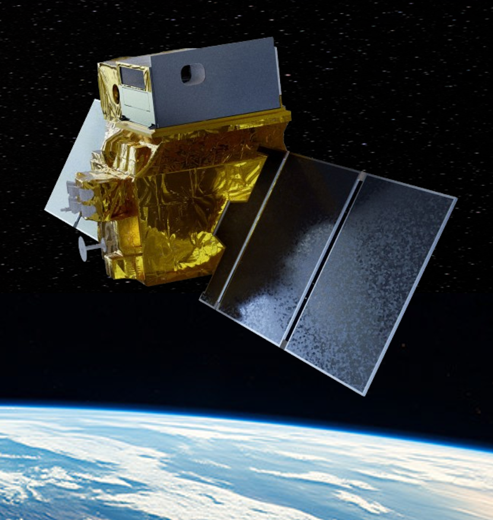{.nostretch width="80%"}
:::

:::

::: {.column width="5%"}
:::

::: {.column width="55%"}

* Measuring the **surface temperature** of land surfaces and coastal zones
* Measuring **evapotranspiration** 
* Measuring with **high resolution** and **high revisit** frequency.

:::

:::

## TRISHNA goals

* Frequent field-scale observations of surface temperatures for continental and coastal areas
* Main Missions : **water in  plants** and **temperature of water surfaces**

  * Plants cool down through transpiration, hot vegetation lacks of water
  * Estimation of water consumption from field to watershed scale
  * Decision support tool for irrigation

* Other missions : temperatures in cities, ice and snow, volcanos, hazards and fires

  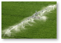
  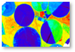
  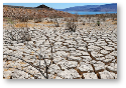
  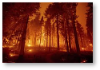
  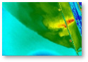
  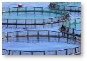
  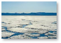
  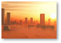
  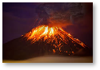

## TRISHNA mission themes 

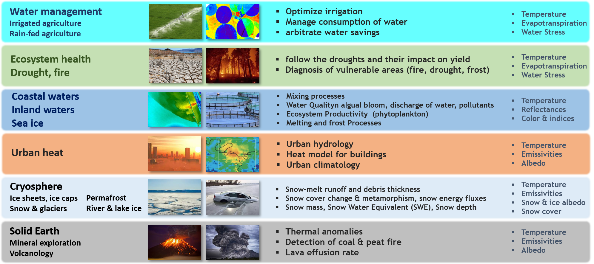

## Indo-French mission overview

::: {.columns}

::: {.column width="50%"}

- ISRO/CNES cooperation
- Launch 2028
- 5-year lifetime
- Design drivers: ecosystem stress and water use; coastal & inlands waters

:::

::: {.column width="50%"}

:::

:::

# TRISHNA mission characteristics

## Orbit overview

::: {.columns}

::: {.column width="55%"}

* Altitude: 761 km, Sun synchronous
* Swath: +/-38° $\rightarrow$ 1030 km
* Local time: 12:30 +/-5 min descending node
* Orbit cycle: 

  * 8 days geometric revisit time, 
  * 3 days revisit  with different viewing angles

:::

::: {.column width="5%"}
:::

::: {.column width="40%"}

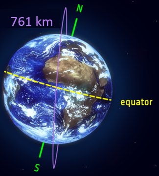

:::

:::

## TRISHNA resolution

* **60m** ground resolution

## Visible to infrared electromagnetic spectrum

* 0.4 μm to 0.75 μm: **Visible**
* 0.75 μm to 1.3 μm: **Near Infrared** (NIR)
* 1.3 μm to 3 μm: **Short Wave Infrared** (SWIR)
* 3 μm to 8 μm: **Middle infrared** (MIR)
* 8 μm to 14 μm: **Thermal Infrared** (TIR)
* 14 μm to 100 μm: **Far Infrared** (FIR)

## TRISHNA spectral bands

- **VNIR-SWIR 7 bands**: day-time acquisition
- **TIR 4 bands**: day-time/night-time acquisition

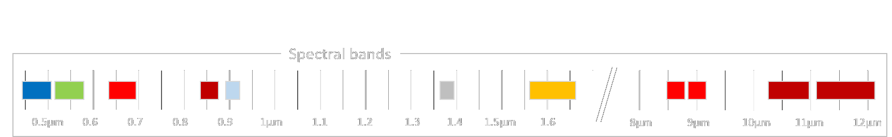

## TRISHNA VNIR-SWIR spectral bands

::: {.text-small}

| Band name | $\lambda$ (µm) | Band width (nm) | Purpose |
|---|---|---|---------------------|
| `Blue`    | 0.485  | 70  | Detection  of low clouds |
| `Green`   | 0.555  | 70  | Coastal,  sediments, snow | 
| `Red`     | 0.670  | 60  | Vegetation (LAI, fCOVER, NDVI,...) |
| `NIR`     | 0.860  | 40  | Vegetation (LAI, fCOVER, NDVI,...) |
| *WV*      | 0.910  | 30  | Water vapour content estimation |
| *Cirrus*  | 1.380  | 30  | Detection of thin cirrus clouds | 
| `SWIR`    | 1.610  | 100 | AOD, snow/cloud  discrimination, vegetation stress , burnt areas |

:::

## TRISHNA TIR spectral bands

::: {.text-small}

| Band name | $\lambda$ (µm) | Band width (nm) | Purpose |
|---|---|---|---------|
| `TIR 1`  | 8.65  | 350  | Temperature/emissivity separation |
| `TIR 2`  | 9.0   | 350  | Temperature/emissivity separation |
| `TIR 3`  | 10.6  | 700  | Split-window |
| `TIR 4`  | 11.6  | 1000 | Split-window |

:::

## Atmospheric transmission

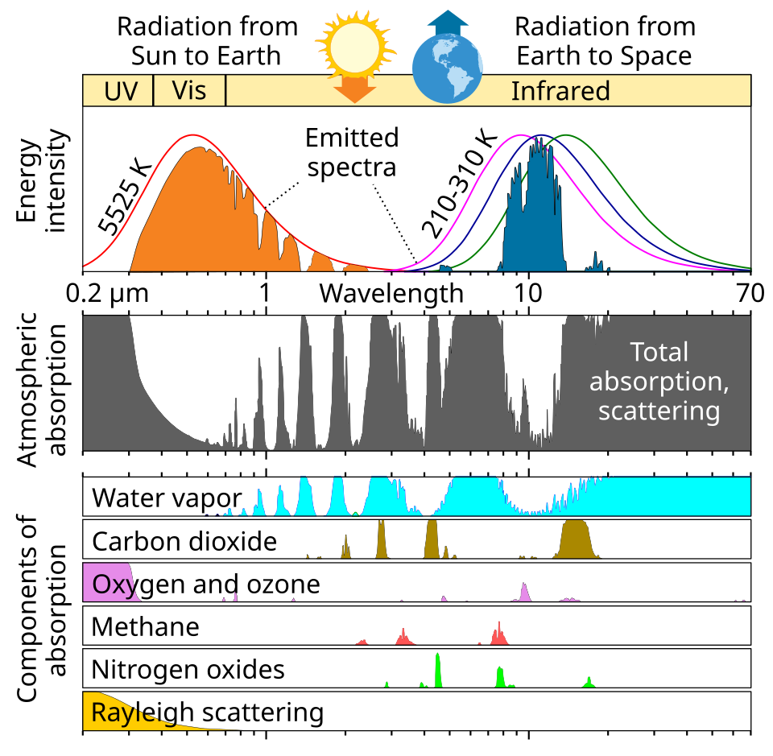

## TRISHNA global coverage land + coastal

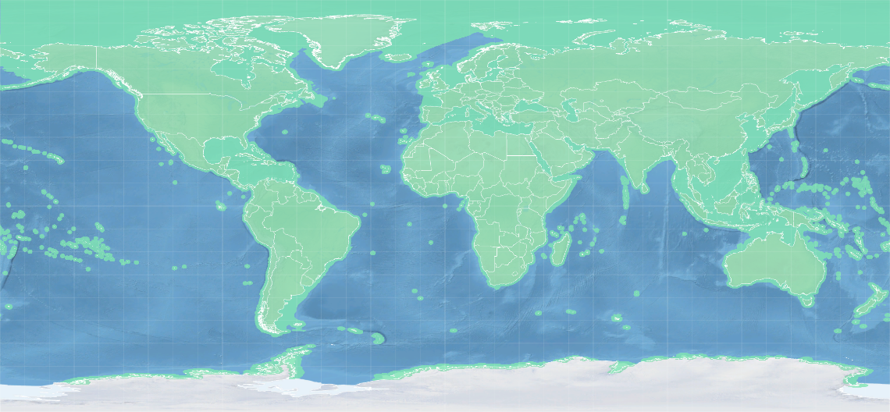{.nostretch width="80%" fig-align="center"}

::: {.text-tiny}

- Continental surfaces
- Coastal areas 100 km from the coastline
- Coastal waters with bathymetry \< 250m + Closed seas + Mediterranean Sea
- Antarctica coastline

:::

## TRISHNA revisit

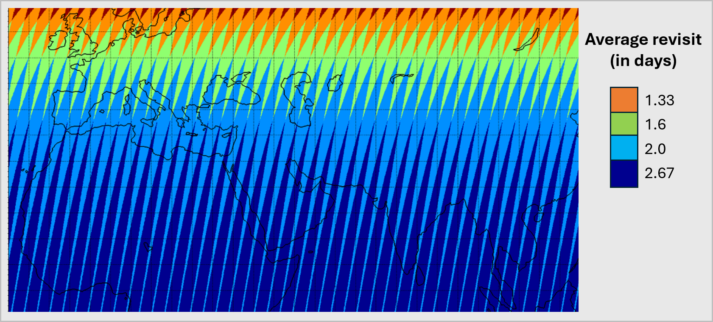{.nostretch width="90%" fig-align="center"}

## TRISHNA overpass time

::: {.columns}

::: {.column width="55%"}

- Overpass time: 12:30 PM & AM at the Equator
- Minimizing the sensitivity of LST measurement to overpass time

:::

::: {.column width="5%"}
:::

::: {.column width="40%"}

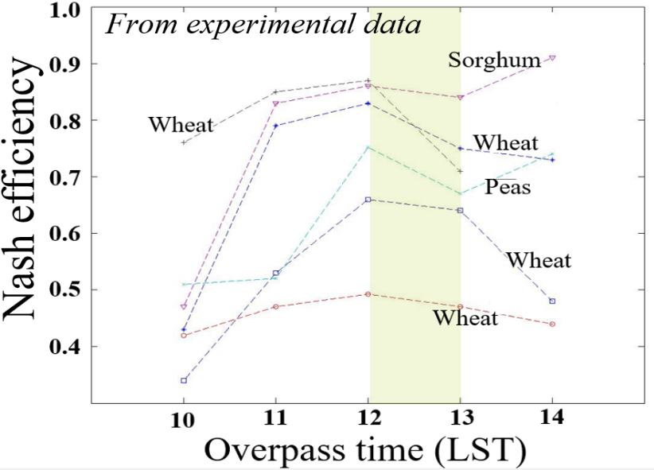{height="3in"}

:::

:::

## TRISHNA observation angles

- Different observation angles, up to 38  deg

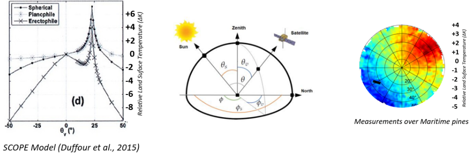{.nostretch width="80%" fig-align="center"}

## TRISHNA Launch

::: {.columns}

::: {.column width="30%"}

* Launch Vehicle : PSLV
* Launch from SDSC-SHAR Sriharikota, Andhra Pradesh, India
* Launch date: 2028

:::

::: {.column width="70%"}

  <figure style="text-align: center; margin: 0;">
    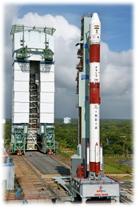
    <figcaption>PSLV Launcher</figcaption>
  </figure>
  <figure style="text-align: center; margin: 0;">
    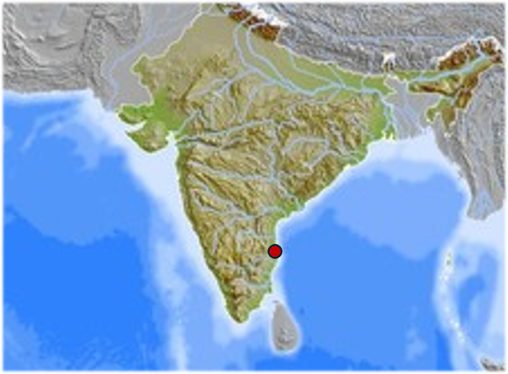
    <figcaption>Launch Site</figcaption>
  </figure>

:::

:::

## TRISHNA satellite characteristics

::: {.columns}

::: {.column width="55%"}

::: {.text-small}

* I-1k bus (ISRO flight heritage)
* Mass: 700 kg (S/C) + 330 (P/L)
* Power generation: 2kW
* Pointing accuracy: +/- 0,05°
* Pointing stability:  5.0 x 10-04 °/s
* TM/TC: S-band, 64 / 4kbps
* X-band data rate: 960 Mbps
* Mass memory: 1.4 Tb
* Mission lifetime: 5 years
* Consumables for: 7 years

:::

:::

::: {.column width="5%"}
:::

::: {.column width="40%"}

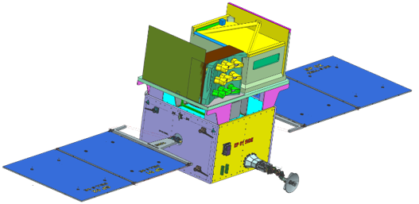

:::

:::

## TRISHNA VIS -- NIR -- SWIR instrument

::: {.columns}

::: {.column width="50%"}

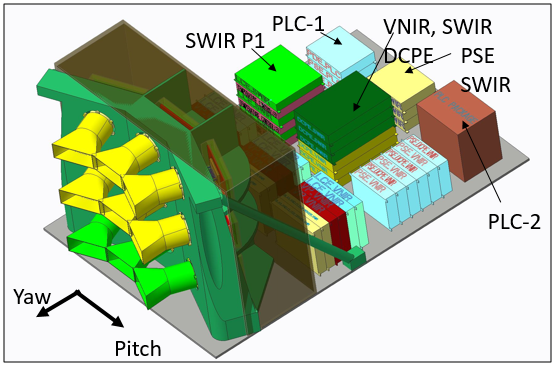
  
:::

::: {.column width="50%"}

* Developed by ISRO / SAC
* Optical Heads	9
* Acquisition	Pushbroom
* Mass 207 kg
* Power	300W/350W
* VIS & NIR bands	5
* SWIR bands 2
* Delivery 2027

:::

:::

## TRISHNA TIR instrument

::: {.columns}

::: {.column width="50%"}

  
:::

::: {.column width="50%"}

* Developed by AIRBUS DEFENCE AND SPACE	
* Acquisition	Across track scanner	
* Mass 210 kg	
* Power	300W/350W	
* Spectral bands 4 TIR
* Wavelength Center	8.65 / 9.0 /10.6 / 11.6μm
* Delivery 2027

:::

:::

## TRISHNA Milestones

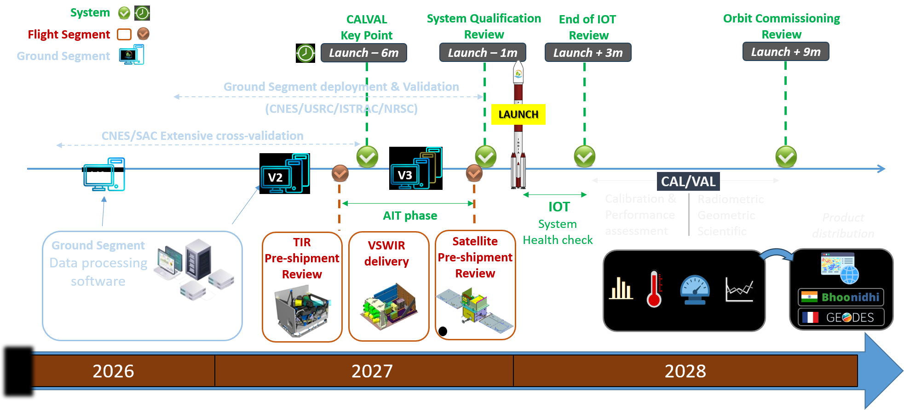

## Indo-French ground segment

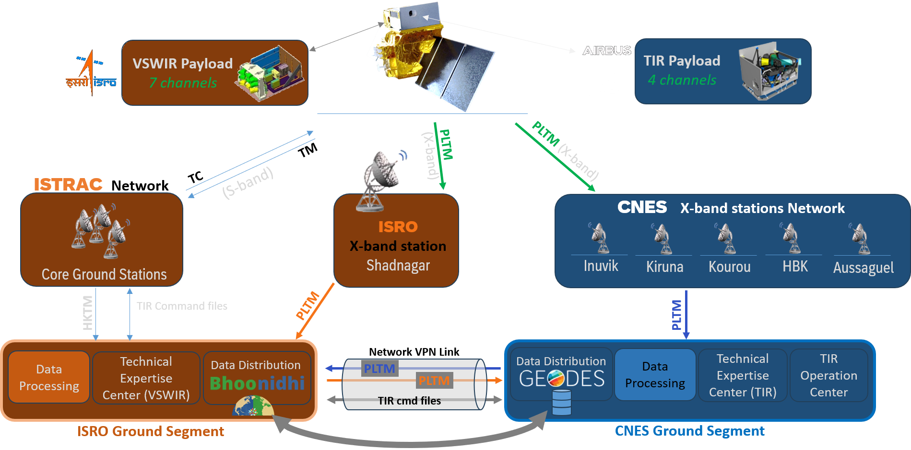

## TRISHNA processing chain

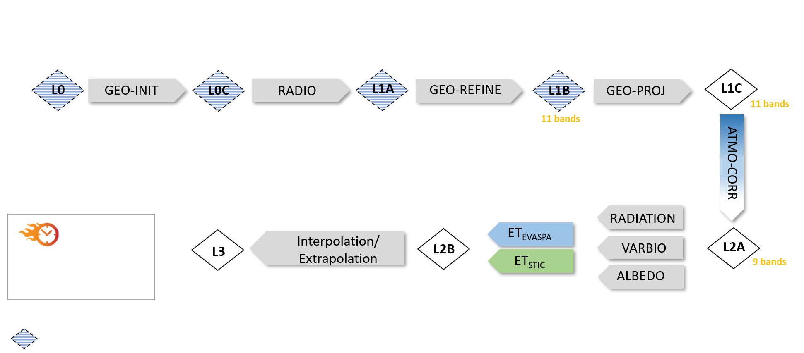

## TRISHNA Production and data distribution

- Free & open data policy
- Objective: 

  - Products available 12h after acquisition for L2A & L2B
  - Products available 15h after acquisition for L3

- Distributed products per day: 81623
- Significant volume: \~10 Po over 7 years

- Indo-french work share: Production, Cataloguing
- Cross-validation

## TRISHNA tile repartition

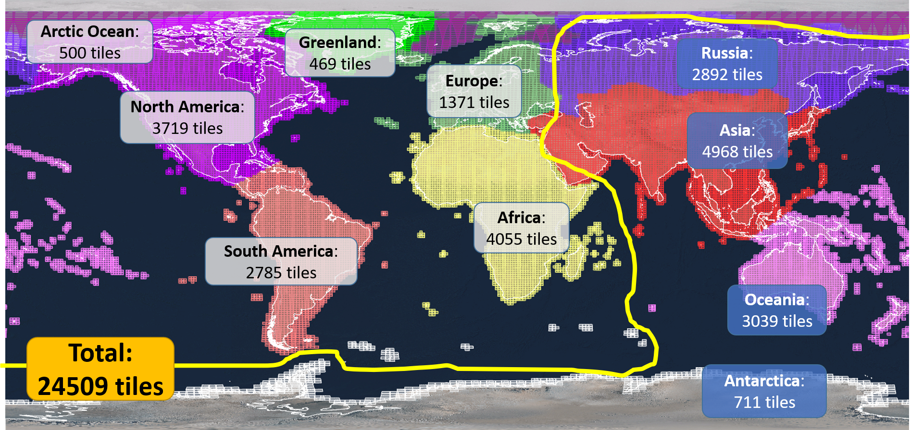{.nostretch width="80%" fig-align="center"}

## TRISHNA cross validation

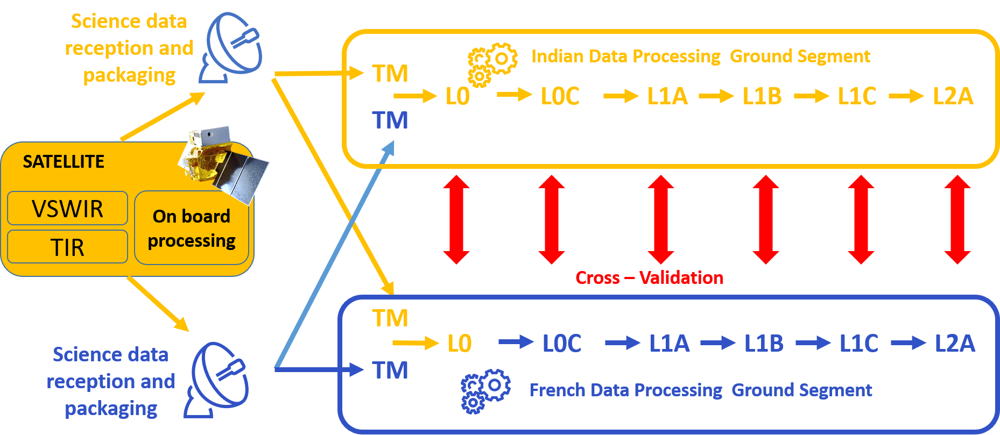

## TRISHNA Portals

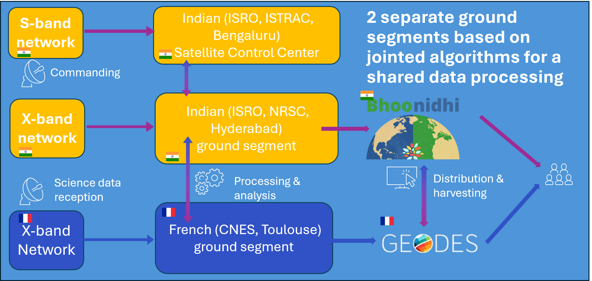

# TRISHNA products

## Definitions

* The **radiance** is the radiant flux in a beam per unit area and solid
  angle of that beam, and is expressed in the SI units $W.m^{-2}.sr^{−1}$.

* The **reflectance** is the ratio of the radiant exitance ($W.m^{−2}$)
  with the irradiance ($W.m^{−2}$). 

$$
\rho_{\lambda} = \frac{\text{Radiant exitance}}{\text{Irradiance}} \in [0,1]
$$

## Distributed products overview 

- **Level 1**: top-of-atmosphere radiances and brightness temperatures
- **Level 2**: 
  
  * Land and water surface reflectances, 
  * Land and Sea Surface temperature, 
  * Land Surface Emissivities, 
  * Vegetation variables, 
  * Albedo, 
  * Daily evapotranspiration
  * etc

## Level 1C products

- TOA reflectances x7 VNIR/SWIR bands
- TOA radiances x4 TIR bands $\Rightarrow$ Brightness temperatures

* $\Rightarrow$ *Radiometrically and geometrically calibrated*
* $\Rightarrow$ *Orthorectified  and resampled on a uniform spatial grid (Sentinel-2 tiles, Copernicus DEM)*

## What is brightness temperature?

### What is a black body ?

* A black body or blackbody is an idealized physical body that absorbs all incident electromagnetic radiation, regardless of frequency or angle of incidence. 

### What is brightness temperature?

It is the temperature of a black body that would have the same radiance as the radiance actually observed with the radiometer.

## Spectral radiance of a black body

Planck's law is defined by 

$$B_{\lambda}(T) = \frac{2hc^{2}}{\lambda^{5}}\frac{1}{\exp{\frac{hc}{\lambda\sigma_{B}T}}-1}$$

where

- $h$ Planck's constant
- $c$ light velocity
- $\sigma_{B}$ Boltzmann's constant
- $T$ temperature

## Radiance transfer in the atmosphere

Radiative transfer equation in the atmosphere:  TRISHNA Level 1C to level 2A

$$
L_{\lambda,TOA} = L^{\uparrow}_{\lambda} +\left[ \rho_{\lambda} \times L^{\downarrow}_{\lambda} + \epsilon_{\lambda} \times B(T) \right]  \times  \tau_{\lambda}
$$

- $\rho_{lambda}$ reflectance
- $\epsilon_{\lambda}$ land surface emissivity
- $T$ land surface temperature
- $L^{\downarrow}_{\lambda}$ downward atmospheric radiance
- $L^{\uparrow}_{\lambda}$ upward atmospheric radiance
- $\tau_{\lambda}$ atmospheric transmittance
- $B_{\lambda}$ spectral radiance of a black body (Planck's law)

## Atmospheric correction 

$$
L_{\lambda}^{TOC}(\theta,\phi) = \frac{L_{\lambda}^{TOA}(\theta,\phi) - L_{\lambda}^{atm\uparrow}(\theta,\phi)}{\tau(\theta,\phi)}
$$

where

- $\theta$ zenith angle and $\phi$ azimuth angle
- $L_{\lambda}^{TOA}$ TOA radiance
- $L_{\lambda}^{atm\uparrow}$ upwelling atmospheric radiance
- $\tau$ atmospheric transmittance

## Top-Of-Canopy Radiance

The TOC radiance includes the surface emission term and the surface
reflected downward atmospheric emission term

$$
L_{\lambda}^{TOC}(\theta,\phi) = \left[ \epsilon_{\lambda}(\theta,\phi) B_{\lambda}(T(\theta,\phi)) + \rho_{\lambda}(\theta,\phi) L^{\downarrow}_{\lambda}(\theta,\phi)\right]
$$

where

- $\theta$ zenith angle and $\phi$ azimuth angle
- $\epsilon_{\lambda}$ land surface emissivity
- $\rho_{\lambda}$ surface reflectance
- $T$ land surface temperature
- $L^{atm\downarrow}_{\lambda}$ downward atmospheric radiance
- $B_{\lambda}$ Planck's law

## Remarks

- The land surface temperature, emissivity and reflectance depend on $(\theta,\phi)$
- The TOC radiance is a function of surface temperature and surface emissivity.
- Emissivity is an intrinsic property of the surface.
- The surface temperature varies with irradiance and local atmospheric conditions.
- $L_{\lambda}^{\downarrow}$, $L_{\lambda}^{\uparrow}$ and
  $\tau$ are estimated with an atmospheric radiative transfer model
  using atmospheric profiles of pressure, air temperature and relative humidity as inputs.

## Emissivity [@norman_terminology_1995]

- For isothermal, homogeneous emitters, the emissivity can be defined
  as the ratio of the actual emitted radiance to the radiance emitted
  from a black body at the same thermodynamic temperature.

- For heterogeneous surfaces that are not in thermal equilibrium, the
  concept of directional emissivity is ambiguous. 

::: {.content-hidden when-format="revealjs"}
::: {.content-hidden when-format="beamer"}

  An ensemble of black bodies at different temperatures does not have a radiance dependence
  on temperature that can be represented by a single black body at a
  single temperature, and the radiance of this ensemble depends on the
  temperature distribution among these black bodies. Therefore, the
  radiance of an ensemble of natural media at different temperatures
  is not simply related to a black body distribution at the same
  effective temperature.

:::
:::

## Level 2A products

- Land & Water Surface reflectances x5 VNIR/SWIR bands
- Land Surface Temperature and Sea Surface Temperature
- Land Surface Emissivity x4 TIR bands
- Cloud mask, Total Water Vapor Content
- *Precision NeDt 0.2K at instrument output, AKA 0.5K*

## Level 2B products: Biophysical variables

- Surface albedo
- Vegetation variables
- Instantaneous radiation
- Daily Evapotranspiration

## Level 2B: Broadband surface albedo

- Instant albedo
- Climate albedo

## Level 2B: Vegetation variables

- Leaf Area Index: LAI
- FAPAR: Fraction of photosynthetically active radiation absorbed by the canopy
- Fraction cover

## Level 2B: Vegetation variables algorithm

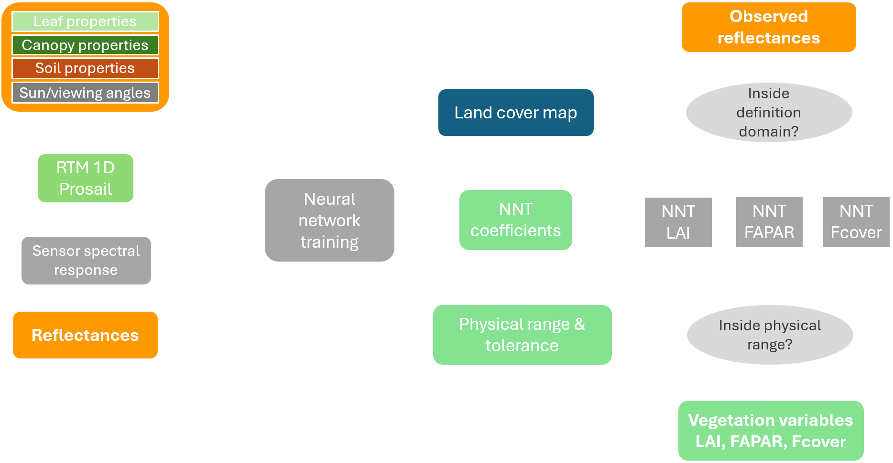

## Level 2B: Instantaneous radiation

- Shortwave downwelling radiation
- Diffuse fraction
- Longwave downwelling radiation

## Level 2B: Daily evapotranspiration

* Contextual daily evapotranspiration (EVASPA)
  
  - Instantaneous evaporative fraction
  - Daily evapotranspiration
  - Water stress indicator

* Single-pixel daily evapotranspiration (STIC)

  - Instantaneous evaporative fraction
  - Daily evapotranspiration
  - Water stress indicator

## Level 3 products

- Continuous time series of daily evapotranspiration

# International cooperation

## Collaboration in Europe

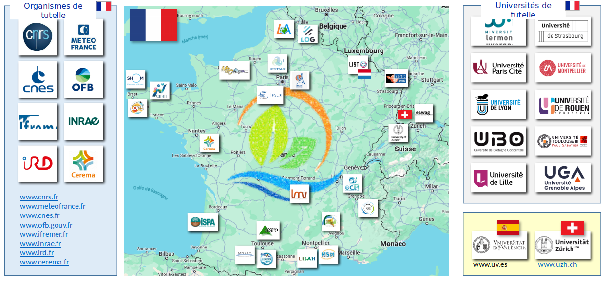

## Collaboration in India

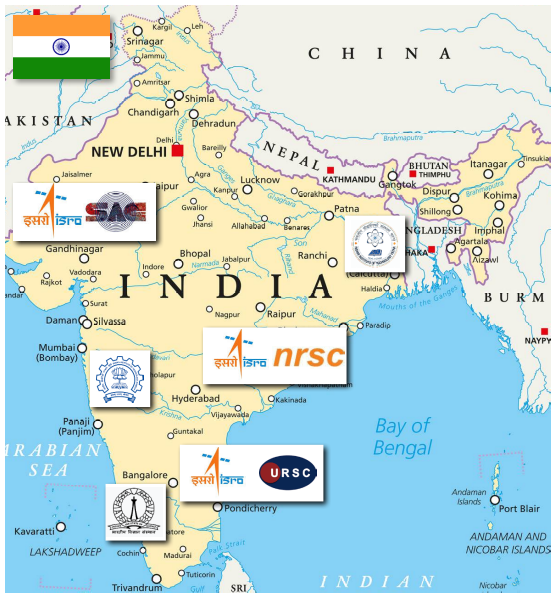

## Earth Observation missions in synergy

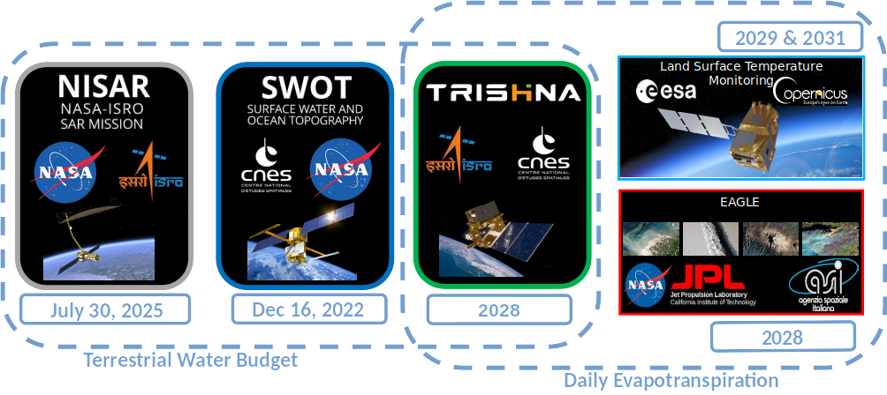
