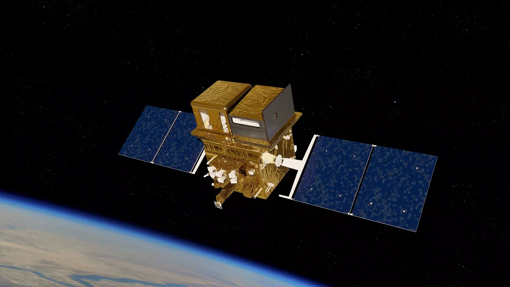
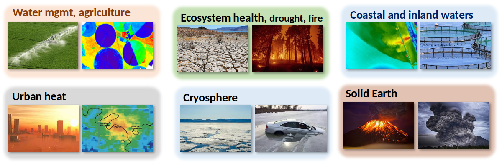
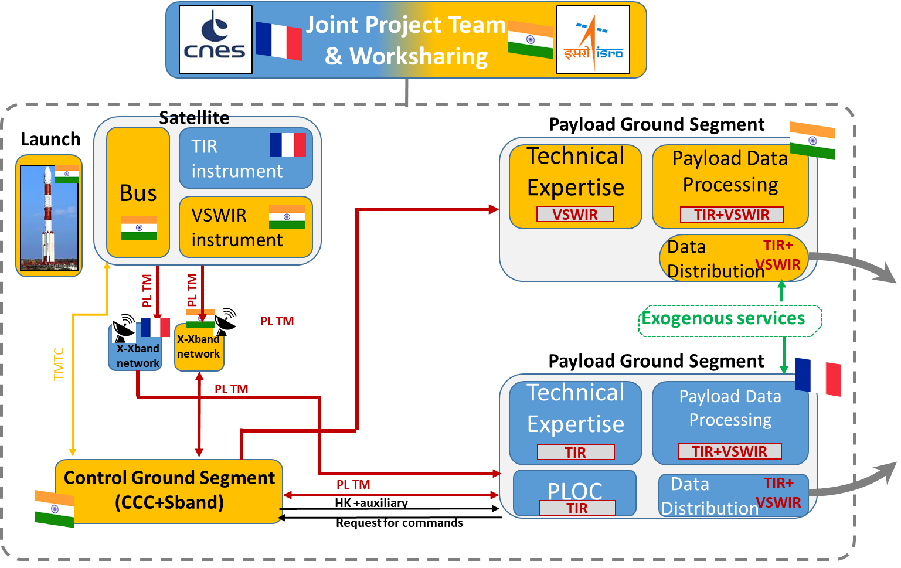
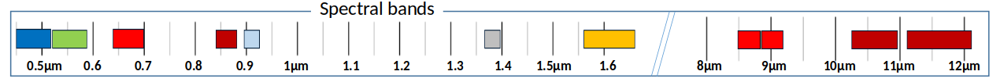
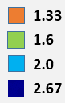
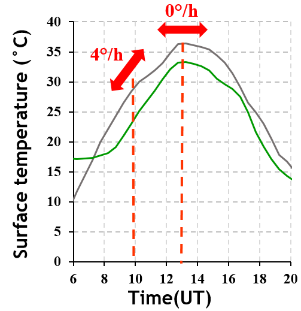
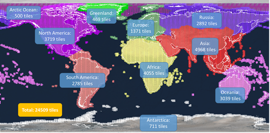
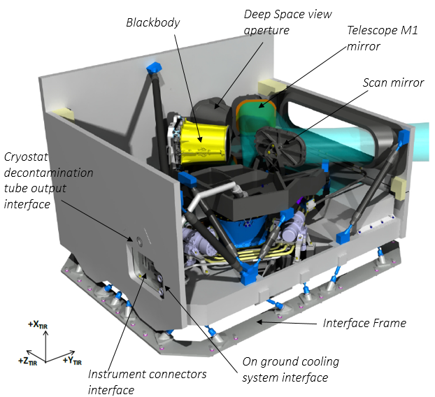

# TRISHNA mission overview

## Indo-French mission

Monitoring our ecosystems from space $\Rightarrow$ Measuring the surface temperature of land surfaces and coastal zones with high resolution and high revisit frequency.

## TRISHNA mission themes 

## Indo-French mission

::: {.columns}

::: {.column width="50%"}

- ISRO/CNES cooperation
- Launch 2028
- 5-year lifetime

:::

::: {.column width="50%"}

:::

:::

## Indo-French ground segment

# TRISHNA mission characteristics

## Overview

* Altitude:761 km, Sun synchronous 
* Swath +/-34° 1030 km
* Local time:12:30 +/-5 min, descending Node
* Orbit cycle: 8 days geometric revisit time, 3 days revisit  with different viewing angles

## TRISHNA resolution

- 60m ground resolution

## Visible to infrared electromagnetic spectrum

* 0.4 μm to 0.75 μm: Visible
* 0.75 μm to 1.3 μm: Near Infrared (NIR)
* 1.3 μm to 3 μm: Short Wave Infrared (SWIR)
* 3 μm to 8 μm: Middle infrared (MIR)
* 8 μm to 14 μm: Thermal Infrared (TIR)
* 14 μm to 100 μm: Far Infrared (FIR)

## TRISHNA spectral bands

- VNIR-SWIR (7 bands): day-time acquisition
- TIR (4 bands): day-time/night-time acquisition
- NeDT  0.2K at instrument output, AKA  0.5K

## TRISHNA VNIR-SWIR spectral bands

::: {.text-tiny}

| Band  name | Wavelength Center (µm) | Bandwidth (nm) | Purpose |
|------------|------------------------|----------------|---------|
| Blue       | 0.485                  |     70         | Detection  of low clouds |
| Green      | 0.555                  |     70         | Coastal,  sediments, snow | 
| Red        | 0.670                  |     60         | Vegetation (LAI, fCOVER, NDVI, ...) |
| NIR        | 0.860                  |     40         | Vegetation (LAI, fCOVER, NDVI, ...) |
| WV         | 0.910                  |     30         | Water vapour content estimation |
| Cirrus     | 1.380                  |     30         | Detection of thin cirrus clouds | 
| SWIR       | 1.610                  |     100        | AOD, snow/cloud  discrimination, vegetation stress , burnt areas |

:::

## TRISHNA TIR spectral bands

::: {.text-tiny}

| Band  name | Wavelength Center (µm) | Bandwidth (nm) | Purpose |
|------------|------------------------|----------------|---------|
| TIR 1      | 8.65                   |     350        | Temperature/emissivity separation |
| TIR  2     | 9.0                    |     350        | Temperature/emissivity separation |
| TIR 3      | 10.6                   |     700        | Split-window |
| TIR 4      | 11.6                   |     1000       | Split-window |

:::

## TRISHNA global coverage land + coastal

{fig-align="center"}

::: {.text-tiny}

::: {.columns}

::: {.column width="50%"}

- Continental  surfaces
- Coastal areas 100 km  from  the coastline
- Coastal waters with bathymetry \< 250m 

:::

::: {.column width="50%"}

- Closed seas + Mediterranean Sea
- Antarctica coastline

:::

:::

:::

## TRISHNA average revisit (in days)

- 3-day revisit

## TRISHNA overpass time

- Overpass time:  12:30  PM  & AM  at the Equator
- Minimizing the sensitivity of LST measurement to overpass time

::: {.columns}

::: {.column width="50%"}

{height="4in"}

:::

::: {.column width="50%"}

{height="4in"}

:::

:::

## TRISHNA observation angles

- Different observation angles, up to 38  deg

# TRISHNA products

## Definitions

*  The **radiance** is the radiant flux in a beam per unit area and solid
    angle of that beam, and is expressed in the SI units $W.m^{-2}.sr^{−1}$.

*  The **reflectance** is the ratio of the radiant exitance ($W.m^{−2}$)
    with the irradiance ($W.m^{−2}$). Following the law of energy
    conservation, the value of the reflectance is in the inclusive
    interval 0 to 1.

## Products overview 

- Free & open data policy
- **Level 1**: top-of-atmosphere radiances and brightness temperatures
- **Level 2**: ground and water reflectances, Land and Sea Surface temperature, Land Surface emissivities, vegetation variables, albedo, daily evapotranspiration

## Level 1C products

- Radiometrically and geometrically calibrated
- Orthorectified  and resampled on a uniform spatial grid (Sentinel-2 tiles, Copernicus DEM)
- TOA reflectances x7 VNIR/SWIR bands
- TOA radiances x4 TIR bands $\Rightarrow$ Brightness temperatures

## What is brightness temperature?

### What is a black body ?
* A black body or blackbody is an idealized physical body that absorbs all incident electromagnetic radiation, regardless of frequency or angle of incidence. 

### What is brightness temperature?

It is the temperature of a black body that would have the same radiance as the radiance actually observed with the radiometer.

## Spectral radiance of a black body

Planck's law is defined by 

$$B_{\lambda}(T) = \frac{2hc^{2}}{\lambda^{5}}\frac{1}{\exp{\frac{hc}{\lambda\sigma_{B}T}}-1}$$

where

- $h$ Planck's constant
- $\sigma_{B}$ Boltzmann's constant
- $T$ temperature

## Top-Of-Atmosphere TIR Radiance

For TIR domain, the Top-Of-Atmosphere (TOA) radiance measured is
composed of multiple terms coming from the surface and atmosphere
emissions.

*Hypothesis*: Neglect contribution of direct and atmospheric scattered
solar energies in TIR range

$$
\tag{TOA Radiance}
L_{\lambda}(\theta,\phi) = \tau_{\lambda}(\theta,\phi) \left[ \epsilon_{\lambda}(\theta,\phi) B_{\lambda}(T(\theta,\phi)) + (1-\epsilon_{\lambda}(\theta,\phi)) L^{atm\downarrow}_{\lambda}(\theta,\phi)\right] + L^{atm\uparrow}_{\lambda}(\theta,\phi)
$$

where

- $\theta$ zenith angle and $\phi$ azimuth angle
- $\epsilon_{\lambda}$ land surface emissivity
- $T$ land surface temperature
- $L^{atm\downarrow}_{\lambda}$ downward atmospheric radiance
- $L^{atm\uparrow}_{\lambda}$ upward atmospheric radiance
- $\tau_{\lambda}$ atmospheric transmittance
- $B_{\lambda}$ spectral radiance of a black body (Planck's law)

## Radiance transfer in the atmosphere

Radiative transfer equation in the atmosphere:  TRISHNA Level 1C to level 2A

$$
L_{\lambda,TOA} = L^{\uparrow} +\left[ \rho_{\lambda} \times L^{\downarrow} + \epsilon_{\lambda} \times B(T) \right]  \times  \tau_{\lambda}
$$

At-sensor Radiance
Radiance from the atmosphere
Radiance leaving the Earth surface
Atmospheric Transmission
## Level 2A products

- Land & Water Surface reflectances x5 VNIR/SWIR bands
- Land Surface Temperature and Sea Surface Temperature
- Land Surface Emissivity x4 TIR bands
- Cloud mask, Total Water Vapor Content

## Top-Of-Canopy Radiance

The TOC radiance includes the surface emission term and the surface
reflected downward atmospheric emission term

$$
\tag{TOC Radiance}
L_{\lambda}^{TOC}(\theta,\phi) = \left[ \epsilon_{\lambda}(\theta,\phi) B_{\lambda}(T(\theta,\phi)) + (1-\epsilon_{\lambda}(\theta,\phi)) L^{atm\downarrow}_{\lambda}(\theta,\phi)\right]
$$

where

- $\theta$ zenith angle and $\phi$ azimuth angle
- $\epsilon_{\lambda}$ land surface emissivity
- $T$ land surface temperature
- $L^{atm\downarrow}_{\lambda}$ downward atmospheric radiance
- $B_{\lambda}$ Planck's law

## Remarks

- The land surface temperature and emissivity depend on $(\theta,\phi)$
- The TOC radiance is a function of surface temperature and surface emissivity.
- Emissivity is an intrinsic property of the surface.
- The surface temperature varies with irradiance and local atmospheric conditions.
- $L_{\lambda}^{atm\downarrow}$, $L_{\lambda}^{atm\uparrow}$ and
  $\tau$ are estimated with an atmospheric radiative transfer model
  using atmospheric profiles of pressure, air temperature and relative humidity as inputs.

## Atmospheric correction 

$$
L_{\lambda}^{TOC}(\theta,\phi) = \frac{L_{\lambda}^{TOA}(\theta,\phi) - L_{\lambda}^{atm\uparrow}(\theta,\phi)}{\tau(\theta,\phi)}
$$

where

- $\theta$ zenith angle and $\phi$ azimuth angle
- $L_{\lambda}^{TOA}$ TOA radiance
- $L_{\lambda}^{atm\uparrow}$ upwelling atmospheric radiance
- $\tau$ atmospheric transmittance

## Emissivity [@norman_terminology_1995]

-   For isothermal, homogeneous emitters, the emissivity can be defined
    as the ratio of the actual emitted radiance to the radiance emitted
    from a black body at the same thermodynamic temperature.

-   For heterogeneous surfaces that are not in thermal equilibrium, the
    concept of directional emissivity is ambiguous. An ensemble of black
    bodies at different temperatures does not have a radiance dependence
    on temperature that can be represented by a single black body at a
    single temperature, and the radiance of this ensemble depends on the
    temperature distribution among these black bodies. Therefore, the
    radiance of an ensemble of natural media at different temperatures
    is not simply related to a black body distribution at the same
    effective temperature.

## Level 2B products

Biophysical variables

- Vegetation variables
- Surface albedo
- Instantaneous radiation
- Daily Evapotranspiration

## Level 2B: Vegetation variables

TODO Decrire BVnet

## Level 2B: Broadband surface albedo

TODO

## Level 2B: Instantaneous radiation

TODO

## Level 2B: Daily evapotranspiration

* Contextual daily evapotranspiration (EVASPA)
* Single-pixel daily evapotranspiration (STIC)
* Water stress indices

## Level 3 products

- Building a continuous time series of daily evapotranspiration (level 3 product)

## TRISHNA Production and data distribution

- Significant volume: \~10 Po over 7 years
- Objective: products available 12h after acquisition for vegetation water stress detection and irrigation management
- Indo-french work share
  - Production
  - Cataloguing
  - Cross-validation

## TRISHNA VIS -- NIR -- SWIR instrument

::: {.columns}

::: {.column width="60%"}

  
:::

::: {.column width="40%"}

- Push-broom  concept
- Developed  by ISRO/SAC

:::

:::

## TRISHNA TIR instrument

::: {.columns}

::: {.column width="60%"}

  
:::

::: {.column width="40%"}

- Developed  by AIRBUS DEFENCE AND SPACE
- Acquisition Across track scanner

:::

:::

## TRISHNA MILESTONES

TODO

## Collaboration in Europe

## Collaboration in India

## International cooperation

- International collaboration (products, ATBDs, orbits, cal/val, campaigns)
- Other thermal remote sensing missions:
  - LSTM (ESA)
  - EAGLE (NASA)

## Earth Observation missions in synergy

